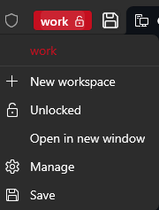
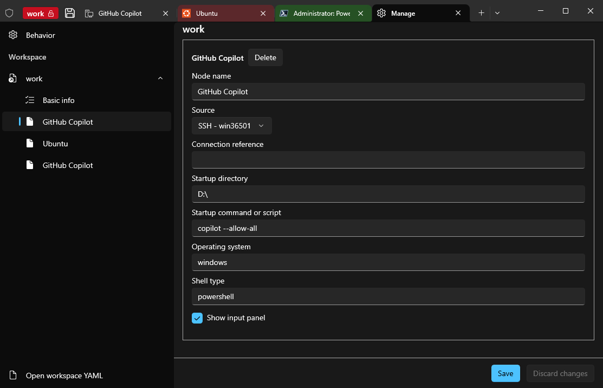

# Windows 终端（极客便携版）

## 项目信息

- **版本**：0.0.1
- **作者**：tommy(tommy.yxd@gmail.com)
## 项目背景
解决极客vibe coding中的痛点问题：
- 多个项目、多个模块同时编程的快速现场恢复
- 命令行方式的agent工具输入麻烦的问题，体验与windows原生组件不一致
- 误操作导致编程窗口丢失的问题

## 文档

- **英文概览**：[README.md](README.md)
- **构建说明**：[ext\README.md](ext/README.md)

## 特性概览

### 工作区

可以通过工作区管理一类场景的进行不同需求开发的终端。
对于工作区：
- 点击左上角的工作区名进入工作区维护，提供统一的管理入口

- 一个工作区只能在一个终端窗口打开
- 通过锁定工作区，避免对工作区的误操作；解除锁定后，即可进行正常的工作区管理

对于工作区里面的每一个终端节点：
- 通过来源（基础版本windows终端的profile里面配置的节点，ssh配置里面节点）、启动目录、启动命令来恢复现场
- 新打开的终端窗口，通过推理判断用户的启动目录/命令，减少配置工作工作量，也可通过管理入口进行校对，为了提升推理的准确性，不建议使用tab等快捷键进行命令补全等操作

### 底部输入面板
- 独立控制：每一个终端节点有各自独立控制是否开启底部输入面包，默认隐藏
- 输入框高度自动调整：默认 1 行高度，并随实际输入行数自动增长
- 发送：`Ctrl+Enter` 会把当前输入发送到激活终端，并补回终端预期的回车行为
- 缓存：每个输入框输入的内容会缓存，重启工作区也不会丢失，便于持续补充内容

### 便携发布

1. 以单文件方式交付与运行。
2. 目前支持英文/中文两个语言版本的发布

### SSH 配置

1. 支持从 SSH 配置文件加载连接信息。
2. 支持对 SSH 信息和终端内已有连接做去重。
