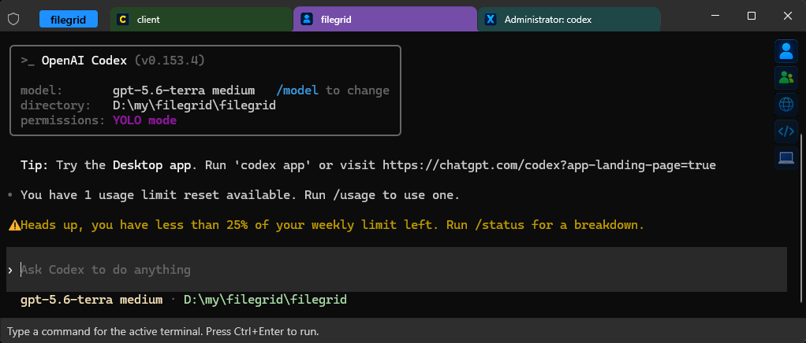
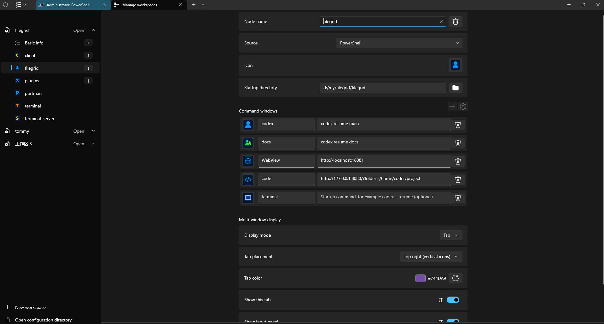
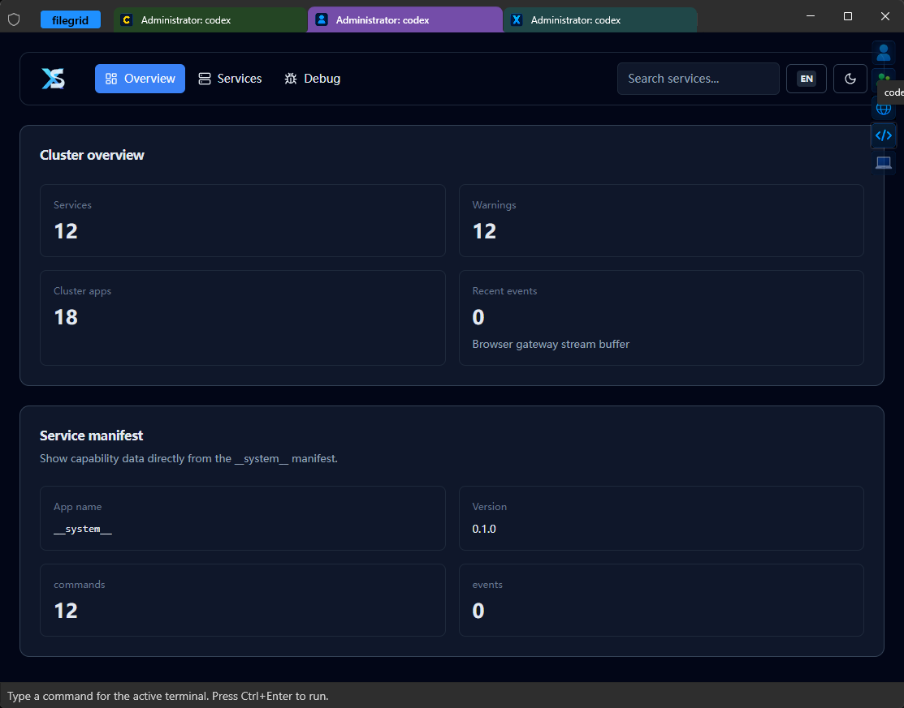
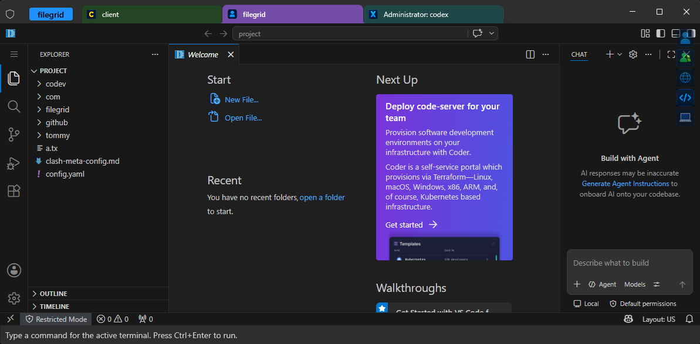

# Windows Terminal Geek Portable Edition

Windows Terminal Geek Portable Edition is a portable, workspace-focused terminal. It keeps the terminals, web tools, startup directories, and commands for one project together, then restores that working context when you reopen the workspace.

## One workspace, one working context

A workspace is a named collection of nodes. A node is one first-level terminal tab and can contain one to five command windows: terminals, local web tools, or intranet pages. This keeps project tools together without filling the top-level tab bar.

- **Workspaces and nodes** — group profiles, SSH connections, startup directories, icons, colors, and startup commands. Lock a workspace when its layout is ready to prevent accidental edits.
- **Command subtabs** — keep related terminal commands and WebView tools inside a node. Put their selector at the top left, top right, or bottom right.
- **Direct execution** — download the release EXE and run it directly; no installer is required.

## Terminals, local tools, and debugging together

Use a node for the shell commands that operate on a project, then add the web views that support that work. A command window can start a terminal command or show an already-running local service URL.

Web windows use the system-installed WebView Runtime. The application does not download, install, package, or select its version. If a page cannot render correctly, install or update the Runtime from the [official WebView page](https://developer.microsoft.com/en-us/microsoft-edge/webview2/), then restart the application.

## Quick start

1. Run the downloaded executable.
2. Select the workspace name at the upper left to open workspace management.
3. Create a workspace and a node, then select a terminal profile and startup directory.
4. Add terminal command windows with `+`, or add a web window with the globe icon and its complete URL.
5. Save and reopen the workspace to create the configured sessions.

Run the downloaded executable directly.

## Documentation

- [User guide](docs/usage/eng/getting-started.md)
- [Workspace node command subtabs guide](docs/usage/eng/workspace-node-command-subtabs.md)
- [Release notes](docs/usage/eng/release-notes.md)
- [中文使用说明](docs/usage/cn/getting-started.md)
- [工作区节点命令子 Tab 使用说明](docs/usage/cn/workspace-node-command-subtabs.md)
- [中文发行说明](docs/usage/cn/release-notes.md)
- [Build guide](README-build.md)

## License and upstream project

This repository is based on the Windows Terminal source tree. Refer to the upstream files under `microsoft/` for license notices and component-level attributions.
