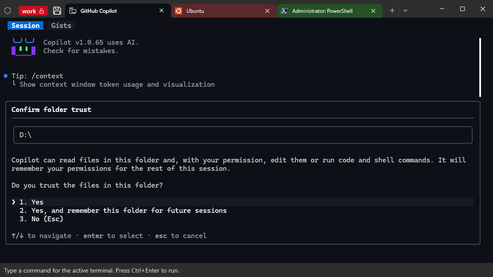

# Windows Terminal Geek Portable Edition

Windows Terminal Geek Portable Edition is a single-file portable distribution
of Windows Terminal with workspace-oriented session recovery and an integrated
input panel for terminal workflows.

## Highlights

- Portable single-file delivery: the final executable extracts and runs without
  requiring an MSIX installation.
- Workspace management: organize related terminal sessions and reopen their
  configured profiles, startup directories, and startup commands.
- Safer recovery: a workspace can be locked to prevent accidental edits.
- Per-terminal input panel: compose multi-line input, send it with
  `Ctrl+Enter`, and retain unfinished text across workspace restarts.
- SSH-aware startup recovery, including Windows targets reached through
  `ssh -t`.

## Documentation

- [Chinese overview](README-cn.md)
- [Build guide](README-build.md)
- [Design and implementation notes](docs/)

## Project layout

- `src/` contains workspace core logic, Terminal-facing glue code, and
  generated build headers under `src/generated/`.
- `res/` contains workspace resources.
- `tools/` contains build and resource-generation utilities.
- `microsoft/` contains the Windows Terminal source tree and its checked-in
  dependencies.
- `bin/` receives the portable release artifact.

## License and upstream project

This repository is based on the Windows Terminal source tree. Refer to the
upstream files under `microsoft/` for its license notices and component-level
attributions.
