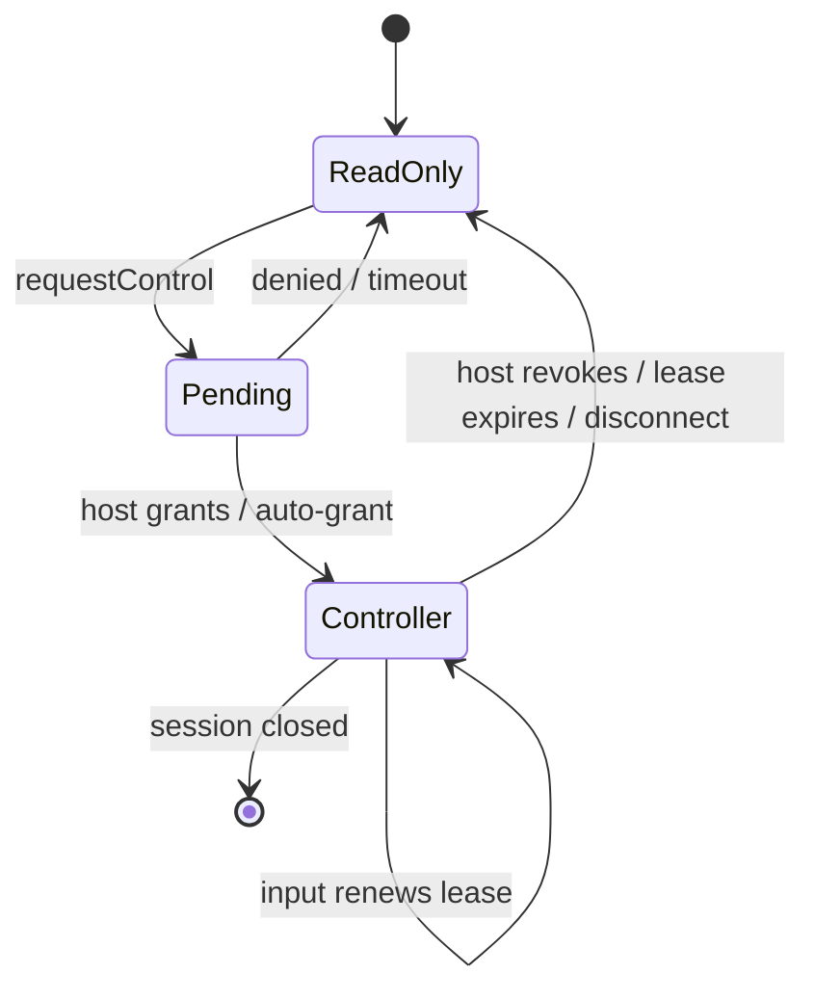

# 01. 需求与范围

## 1. 问题陈述

用户在本机终端中运行长任务、全屏 TUI Agent（例如编码 Agent、文件浏览器、监控面板）或调试会话时，往往需要在第二块屏幕、浏览器或另一台受控设备继续查看并偶尔输入。现有 Terminal 标签只能由单个 UI 控件承载；简单地把 PTY 输出直接广播给 WebSocket 虽能演示，却无法正确处理后加入者、断线、备用屏状态、鼠标协议、浏览器慢消费、控制权冲突和暴露网络端口后的风险。

Mirror 的目标是把**已由 Workspace Node 启动并从启动起记录的会话**安全地 attach 到多个端，而不是创建另一份 shell、复制命令或同步普通文本缓冲区。

## 2. 用户故事与验收标准

| 编号 | 用户故事 | 可验收结果 |
| --- | --- | --- |
| R1 | 作为本地用户，我想从已启动的 Workspace Node 在另一台设备继续查看。 | Node 启动时已有可 attach 会话；Host Wrapper 可按 Node 的多窗口布局加入，不需要中途开启同步。 |
| R2 | 作为旁观者，我想从另一设备的 Terminal Host Wrapper 查看实时终端。 | Host Wrapper 的 WebView 与浏览器使用同一客户端；加入后恢复 Node 内每个窗口的 TUI 现场和后续输出。 |
| R3 | 作为控制者，我想从一个附属端继续操作 shell。 | 获得控制租约后键盘、粘贴、Ctrl+C、TUI 所需的鼠标/焦点事件等均经现有 `WriteInput()` 有序进入同一个 ConPTY。 |
| R4 | 作为主端用户，我想始终能收回控制。 | 本地 Host 一键抢占控制；被抢占客户端立即只读并得到原因。 |
| R5 | 作为断线用户，我想重新连接不丢当前画面。 | 重连携带 resume 序号；缓冲仍在时补齐增量，否则下发新基线。 |
| R6 | 作为安全管理员，我不想无意暴露 shell。 | 默认只监听 loopback、令牌短期有效、不会把令牌写入日志，远程绑定明确告警。 |

## 3. 功能范围

### 3.1 第一阶段（MVP）

```text
Workspace Node 启动 → Core 创建 Node/Window Recorder → Host Wrapper / Browser 加入
                                                             │
                                      Node layout + TUI checkpoint + 增量 ◀──┤
                                                             │
本地 Host ──────────────────────── 申请/授予控制 ── 控制端 ── 输入写回指定 ConPTY
```

1. 每个配置为可镜像的 Workspace Node 在启动时创建 Node Mirror Session，并为 Node 的每个 command window 从启动起记录；普通临时 Tab 不创建该能力。
2. 支持任意数量的只读客户端；默认最多 8 个活跃连接，可配置上限 1–32。
3. 支持 0 或 1 个输入控制者；控制权由本地 Host 管理，默认 30 秒租约且活动输入自动续租。
4. 支持另一设备上的 Terminal Host Wrapper（WebView）和浏览器。两者使用同一内置 Web terminal application、WebSocket 协议、xterm.js 渲染与状态恢复逻辑；不维护第二套桌面同步协议。
5. 支持主端 resize 事件；第一期只有 Host 改变 ConPTY 尺寸。附属端 resize 只影响其 CSS 展示，不调用 `ConptyConnection::Resize()`。
6. 每个 window 从启动起记录输入、输出、resize、标题与 checkpoint；运行期使用有限环形缓存和状态快照，默认保留当前完整现场及其后的增量。
7. 支持连接、授权、控制权、断开和错误的结构化审计事件；不记录终端正文与输入正文。
8. 必须支持现代 TUI 所依赖的终端状态：主/备用屏切换（DEC 47/1047/1049）、光标位置/形状/可见性、SGR/256 色/truecolor、滚动区域、DEC 私有模式、UTF-8 宽字符、OSC 8 超链接、OSC 标题、bracketed paste、focus reporting 与鼠标追踪（X10/VT200/SGR）。

### 3.2 明确不做

- 不复制无限 scrollback；但必须恢复正在显示的 TUI 的**活动屏幕和输入模式**。复杂图形协议（sixel、kitty graphics、iTerm2 inline image）和终端查询响应的完整仿真不属于第一期，遇到时需能力告警而非静默错误渲染。
- 不允许多用户同时写入一个会话；不做 OT/CRDT 字符级协作编辑。
- 不在 Host 退出后继续运行进程；这不是 tmux server/daemon 替代品。Node runtime 日志默认也不跨应用进程持久化。
- 不默认支持公网、跨 NAT、账号体系、文件传输、剪贴板同步或远程创建任意新 shell。
- 不为 `AzureConnection`、`EchoConnection` 等非 ConPTY 连接在第一期承诺镜像；接口可扩展，能力由连接报告。

## 4. 质量属性与约束

| 属性 | 目标 | 设计含义 |
| --- | --- | --- |
| 输出延迟 | 本机 p95 端到端 < 100 ms（无背压时） | tap 仅入有界队列，不在 ConPTY 输出线程进行网络 I/O。 |
| 本地交互 | 无镜像/慢客户端时不回退 | 镜像投递失败或排队满只能丢弃镜像并标记 resync，绝不能阻塞 `TerminalOutput`。 |
| 恢复 | 10 秒断线可常规恢复 | 帧有递增 seq，历史窗口不足则强制重新基线。 |
| 正确性 | 同一客户端按 seq 有序输出 | 单一 Agent 分配序号和序列化广播；客户端去重、缺口检测。 |
| 资源 | 每会话默认 ≤ 12 MiB 镜像内存 | 输出环 4 MiB、基线 4 MiB、每慢客户端待发 1 MiB（达到阈值断开/重同步）。 |
| TUI 保真 | 主端与新 attach 端同屏状态一致 | 快照含活动 buffer、光标、属性、模式及 viewport；测试覆盖备用屏和鼠标模式。 |
| 可访问性 | Web 客户端可键盘操作 | 控制状态可见，焦点与只读状态有 ARIA 提示。 |

## 5. 关键产品规则

### 输入与控制



- 本地 Host 永远可输入，不需要 lease；它输入时不取消远端 lease，但 UI 提示“本地也在操作”。Host 可显式“抢回”。
- 默认策略为 `hostApproval`：远端申请后由 Host 批准。可选 `autoGrantWhenIdle` 只在没有控制者时自动授予。
- 输入帧必须携带有效 `leaseId`；过期、错误会话或只读令牌的输入丢弃并回 `inputRejected`，不尝试部分写入。
- 除 Host 发出的主尺寸通知外，镜像客户端不得驱动 PTY 行列数，避免一台手机导致主屏 TUI 重排。
- 当控制端接管且 TUI 启用了鼠标/焦点/括号粘贴模式时，客户端必须按当前终端模式编码相应输入；只读端绝不能发送这些事件。

### 会话生命周期

```text
Created ──start──> Active ──tab close / stop──> Draining ──all closed──> Closed
                   │                                  │
                   └── no clients: 仍 Active           └── endpoint、令牌、缓存销毁
```

`SessionId` 使用随机 GUID，展示给用户的是不含秘密的标识。令牌独立生成、不可由 SessionId 推导。Workspace Node 关闭时，Core 先发送 `sessionClosed`，给网关最多 500 ms flush，再撤销 endpoint；无论是否 flush 完成，ConPTY 关闭流程不等待网络。

## 6. 参考方案差异与理由

参考文档提出在 `ConptyConnection::_OutputThread()` 中直接调用 `_BroadcastToWeb`，并把网页消息直接 `WriteInput`。该做法可作为原型，但不满足本设计目标：

| 原型做法 | 风险 | 本设计替代 |
| --- | --- | --- |
| 输出线程持有 WebSocket 客户端集合并发送 | 慢连接反压、锁竞争和异常影响 PTY drain | `MirrorTap` 非阻塞入队，Agent 独占网络状态。 |
| 新连接只接未来输出 | 无法看见当前 TUI 画面 | 基线重放 + seq 增量恢复。 |
| 所有连接可 `WriteInput` | 输入交错，公网端口等同裸露 shell | 令牌权限 + 单一 control lease。 |
| 每个 tab 监听固定端口 | 端口冲突、发现困难、难以鉴权 | 一个 Agent 网关、多会话路由 `/v1/sessions/{id}`。 |
| 浏览器 resize PTY | 每个端尺寸互相打架 | 只有 Host 有 resize 权。 |

## 7. 待产品确认

1. 本机 Web 镜像地址的呈现方式：仅复制链接，还是同时提供 QR 码？
2. 是否需要将“允许远程 LAN 访问”作为实验性开关；若需要，证书来源和防火墙交互须在实施前定稿。
3. 主端屏幕是否应该包含在活动屏外的 scrollback；推荐第一期仅当前主/备用活动屏，后续用 TerminalCore 导出模型能力实现。
