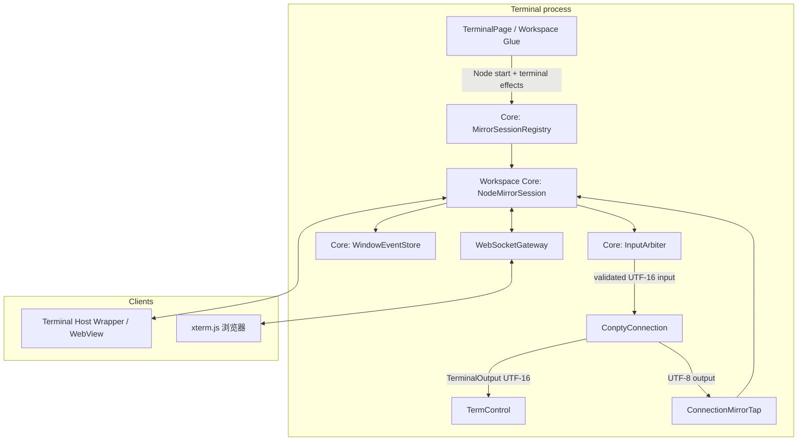
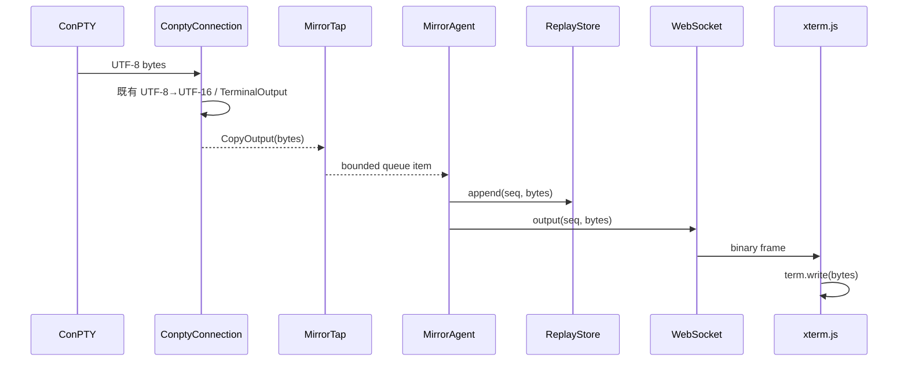

# 02. 总体架构

## 1. 架构原则

1. **Core 是唯一控制平面和状态权威。** Node Mirror Session、窗口事件日志、检查点索引、恢复规划、控制租约、Node 布局快照和协议 DTO 均实现于 `src/core/workspace`；任何 Glue/Host/WebView 都不能绕过 Core 直接决定状态或控制权。
2. **旁路而非劫持。** Terminal 原有输出链 `ConPTY → _OutputThread → TerminalOutput → TermControl` 保持可用，即便 recorder/gateway 故障也不受影响。
3. **Glue/Host 只接线和显示。** `TerminalConnection` 只提供原始 I/O tap 与写入适配；Glue 只把 Node 启动、ConPTY 和 Core effect 连接起来；Host/WebView 只显示 Core projection、发送 intent；HTTP/WebSocket 不进入 WinRT Connection 类型。
4. **一个逻辑发布者。** 每个 Node Session 由 Core 的串行状态机处理输出、状态变化和控制权，因而可分配全序 `nodeSeq` 和各 window `windowSeq` 并简化恢复。

## 2. 组件图



### 2.1 模块职责

| 模块 | 责任 | 不负责 |
| --- | --- | --- |
| `ConnectionMirrorTap` | 从连接安全复制原始 I/O、报告连接关闭/尺寸 | 网络传输、用户权限、缓存策略 |
| `MirrorSessionRegistry`（Core） | 按 `nodeId + commandId` 创建、查找、销毁会话；令牌元数据 | 解析 VT、渲染 UI |
| `WorkspaceNodeMirrorSession`（Core） | Node/Window 状态机、事件顺序、布局快照、恢复批次与授权 | 阻塞读 PTY、直接网络写 |
| `WindowEventStore`（Core） | 保存启动以来 I/O 事件、checkpoint 与 seq 范围 | 无界或跨进程持久 scrollback |
| `InputArbiter`（Core） | 授权、lease、输入大小/速率检查、生成写入 effect | 命令级安全过滤 |
| `WebSocketGateway` | WebSocket 握手、帧编码、连接级背压/TLS | 拥有会话业务状态 |
| Web client | 协商、重放、xterm.js 渲染、申请控制 | 信任本地客户端提交的权限 |

## 3. 数据流

### 3.1 输出：实时与历史



`CopyOutput` 必须在 UTF-8 转换前取得 bytes，以避免坏 UTF-8、代理对和编码往返改变数据。它只复制至固定容量的 MPSC 队列；如果队列满，设置 `outputGap` 标记并返回。下一次 Agent 获取控制后将要求所有受影响客户端重新基线，而不能拖慢 `_OutputThread()`。

### 3.2 加入与恢复

```text
Client                Gateway / Agent                       ReplayStore
  | hello(token, lastSeq?) |                                     |
  |----------------------->| authenticate / authorize            |
  |                        |----- read baseline + range ------->|
  |                        |<---- snapshot, seq frames ---------|
  | welcome(session,baseSeq,mode)                                |
  |<-----------------------|                                     |
  | baseline bytes         |                                     |
  |<-----------------------|                                     |
  | output(baseSeq+1...)   |                                     |
  |<-----------------------|                                     |
```

为保证基线和增量之间没有竞态，Agent 在同一串行执行器中完成：冻结当前 `headSeq` → 复制基线/所需范围 → 将客户端标记为 `catchingUp` → 发送至 `headSeq` → 切换为 `live`。`live` 前产生的帧只追加到该客户端的待发队列。若其待发队列超限，关闭连接并让客户端重连，不进行无限堆积。

## 4. 会话状态模型

```mermaid
stateDiagram-v2
  [*] --> Inactive
  Inactive --> Starting: user enables mirror
  Starting --> Active: endpoint bound, token issued
  Starting --> Inactive: bind/start failed
  Active --> Active: client joins/leaves; output
  Active --> Draining: stop / tab closing
  Draining --> Closed: 500ms flush or deadline
  Closed --> [*]
```



会话 metadata：

```cpp
struct MirrorSessionDescriptor {
    winrt::guid sessionId;       // public identifier, random
    uint64_t contentId;          // internal Terminal content association
    MirrorCapabilities capabilities;
    MirrorEndpoint endpoint;     // loopback URL / named-pipe name
    std::chrono::steady_clock::time_point expiresAt;
    uint32_t cols, rows;         // Host-authoritative size
    uint64_t headSeq;
};
```

`contentId` 不向网络公开。URL 的 session id 与令牌均不足以枚举其他标签；Registry 只允许通过 Host UI 将当前 `contentId` 注册成 mirror session。

## 5. 快照策略

终端的 ANSI 字节流不是无状态日志。中途开始向 xterm.js 写数据会得到错误画面，尤其是正在运行备用屏 TUI 时，因此需要一个可重放起点。正式方案的 checkpoint 是**可序列化终端状态快照**，由 TerminalCore 的权威 buffer/model 导出：活动屏（主/备用）、两套 buffer 中必要内容、cursor、rendition、调色板引用、scroll region、tab stops、字符集与 DEC/输入模式。客户端将该状态装载到兼容 terminal emulator，随后再消费 `baseSeq` 后的原始 VT bytes。

“reset + 清屏 + 当前可视区域 VT 重放”只能用于验证输出链的原型，不满足 TUI attach 验收：它通常丢失备用屏、应用模式、光标形状、鼠标/focus/bracketed-paste 状态及不可见但会影响后续输出的状态。实现快照需要由 TerminalCore/TermControl 暴露专用 `ExportMirrorState()`，不能通过屏幕抓图、反向解析任意 byte stream 或只读 `TerminalOutput` 推断。

```text
[serialized terminal state: main/alt buffers + cursor + modes] [seq 480..760 deltas]
                              ↑ baseSeq                           ↑ headSeq
```

若导出接口尚未实现，可用字节 replay 作为**内部网络原型**，但不能宣称支持 TUI Agent，且不得进入面向用户的 MVP/GA。对外可用版本的验收前必须具备包含活动 buffer 和 modes 的 terminal-state snapshot。

## 6. 线程与失败隔离

| 上下文 | 可做 | 禁止做 |
| --- | --- | --- |
| ConPTY 输出线程 | 复制 bytes、无锁/短临界区入队、发 event | 等待网络、压缩大数据、调用 UI、获取会话长锁 |
| UI 线程 | 启停、显示地址、宿主抢控制、通知尺寸 | 处理每一块输出 |
| Agent 串行执行器 | seq、缓存、状态机、授权与投递决策 | 调 `WriteFile` 或同步网络写 |
| 网关 I/O | WebSocket 读写、握手、每连接队列 | 修改会话状态（通过投递 Agent 命令） |

任何 Mirror 异常应产生诊断事件、关闭受影响连接或停用该会话。禁止从错误路径关闭 `_hPC`、改变 `ConnectionState` 或吞掉 `TerminalOutput`。

## 7. 配置模型

建议在全局设置新增 `mirror` 对象，而不是污染 profile/connection 的启动字段：

```json
{
  "mirror": {
    "enabled": false,
    "listen": "loopback",
    "port": 0,
    "maxClientsPerSession": 8,
    "historyMiB": 4,
    "controlPolicy": "hostApproval",
    "leaseSeconds": 30
  }
}
```

`port: 0` 表示由 OS 选择空闲端口。端口属于 Agent，不属于标签；不同 Session 通过路径和令牌区分。配置解析应落在 `TerminalSettingsModel`，运行时服务接收已验证 DTO，不直接读取 JSON。
