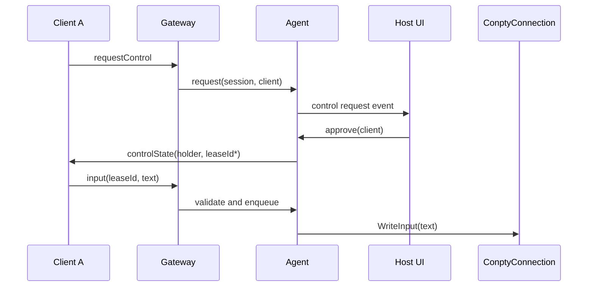

# 03. 协议与状态同步

## 1. 传输与版本协商

Web 客户端使用 `wss://`（远程）或 `ws://127.0.0.1`（默认本机）的 WebSocket。URL 只定位资源，秘密通过 `Sec-WebSocket-Protocol` 传递，避免令牌出现在常见访问日志和 Referer：

```text
GET /mirror/v1/sessions/{sessionId} HTTP/1.1
Sec-WebSocket-Protocol: wt-mirror.v1, bearer.{base64url-token}
Origin: https://terminal.local
```

网关验证 Origin（本机嵌入页/允许列表）、会话存在、令牌哈希、过期和权限后才完成 upgrade。协议 `wt-mirror.v1` 必须协商成功；未知主版本拒绝，新增可选字段使用向前兼容的 object encoding。

控制/状态帧为 UTF-8 JSON，终端输出用 WebSocket binary frame，避免字节流 base64 膨胀。每帧最大 256 KiB；更大输出按字节分块而不重排 UTF-8（客户端直接将 Uint8Array 交给 xterm.js）。

## 2. 帧目录

| 方向 | 类型 | 必填字段 | 说明 |
| --- | --- | --- | --- |
| C→S | `hello` | `type`, `protocol`, `resumeSeq?` | upgrade 后首帧，5 秒内必须到达。 |
| S→C | `welcome` | `session`, `permissions`, `headSeq`, `cols`, `rows`, `sync` | 告知本次采用 `resume` 或 `baseline`。 |
| S→C | `baseline` | `baseSeq`, `format`, `state` | 可序列化 terminal state snapshot；首版格式为 `wt-terminal-state.v1`。 |
| S→C | `output` | binary header: seq, flags | 实时/补发的终端 bytes。 |
| C→S | `requestControl` | `requestId` | 申请 lease。 |
| S→C | `controlState` | `holder?`, `leaseExpiresAt?`, `reason?` | 所有客户端都收到。 |
| C→S | `input` | `leaseId`, `text` | UTF-16 文本，最大 64 KiB。 |
| S→C | `inputRejected` | `reason` | 无效/过期 lease、限流等。 |
| S→C | `resize` | `cols`, `rows`, `generation` | Host 尺寸变化通知。 |
| 双向 | `ping` / `pong` | `nonce` | 应用层活性与延迟测量。 |
| S→C | `error` / `sessionClosed` | `code`, `message` | 可展示、可机器处理的结束信息。 |

## 3. 编码

### 3.1 JSON 示例

```json
{"type":"hello","protocol":1,"resumeSeq":"0000000000000197","client":{"kind":"web","name":"Chrome"}}
```

```json
{"type":"welcome","session":"7b47711c-...","permissions":["view","request-control"],"headSeq":"0000000000000204","cols":120,"rows":32,"sync":"resume"}
```

序号在 JSON 中采用十进制字符串，避免 JavaScript `Number` 的 53 位精度限制。`sessionId` 标准 GUID 小写形式；时间为 RFC 3339 UTC 字符串。错误码为稳定 kebab-case，如 `invalid-token`、`resume-too-old`、`lease-expired`。

### 3.2 二进制输出帧

```text
0                   1                   2                   3
0 1 2 3 4 5 6 7 8 9 0 1 2 3 4 5 6 7 8 9 0 1 2 3 4 5 6 7 8 9 0 1
+---------------+---------------+-------------------------------+
| version (1)   | flags (1)     | reserved (2)                  |
+---------------+---------------+-------------------------------+
| seq (uint64, big endian)                                      |
+---------------------------------------------------------------+
| payloadLength (uint32, big endian)                            |
+---------------------------------------------------------------+
| UTF-8 VT bytes ...                                             |
+---------------------------------------------------------------+
```

`flags.bit0 = checkpoint-boundary`，`bit1 = replay`。seq 每个逻辑输出块加一；分块时每块各有 seq，客户端只按 seq 串行写入。客户端收到重复 seq 忽略，发现 `receivedSeq + 1 < seq` 时暂停渲染并发送 `resync`；不得猜测丢失字节。

### 3.3 `wt-terminal-state.v1` 快照契约

快照可以使用 binary CBOR/FlatBuffers 编码以控制大小，但其语义版本必须稳定，至少包含：`activeBuffer`、主/备用 buffer 的 row/cell（codepoint、width、attribute id）、cursor（x/y/style/visibility）、viewport、scroll region、saved cursor、modes（applicationCursor、applicationKeypad、bracketedPaste、focusEvent、mouseTracking、mouseEncoding、origin、wrap、insert）、title、hyperlink table 和 palette generation。服务端只有在完整、原子地取得快照并记录 `baseSeq` 后才能发送 `baseline`。

Web 客户端若用 xterm.js，需实现 state-loader：`term.reset()` 后按状态填充/重放两个 buffer，最后恢复活动 buffer、cursor 与 modes；不能只 `term.write` 可见文本。若 xterm.js 的公开 API 无法安全设置某项状态，应在其上游新增正式 state restore API，或改用与 TerminalCore 共享状态模型的 renderer；不得依赖私有 JS 字段进入 GA。

## 4. 同步算法

```mermaid
flowchart TD
  A[hello resumeSeq?] --> B{resumeSeq 在连续窗口内?}
  B -- 是 --> C[发送 welcome: resume]
  C --> D[发送 seq > resumeSeq 至 headSeq]
  B -- 否/无 --> E[生成或读取 checkpoint]
  E --> F[发送 welcome: baseline]
  F --> G[发送 baseline(baseSeq)]
  G --> H[发送 seq > baseSeq 至 headSeq]
  D --> I[转 live]
  H --> I
  I --> J{客户端队列超限?}
  J -- 否 --> I
  J -- 是 --> K[error slow-client 并关闭]
```

服务端在执行上述分支期间持有**逻辑序列化**，不持有网络 socket 锁。`headSeq` 之后的实时帧进入客户端的有限待发队列，完成历史发送后按序清空。若重放缓存中有 `outputGap`，所有 `resume` 均降级 baseline；如基线本身不可用，回 `resync-unavailable` 并建议用户在 Host 重新开启镜像。

## 5. 输入、租约与限流



`leaseId` 是 128 bit 随机不可猜值，仅在授予者的私有 `controlGranted` 帧中发送；公开 `controlState` 不含它。输入请求执行以下检查，任何失败不调用连接：

1. 会话 Active，token 有 `control` 或 `request-control` 权限；
2. client id 正是当前 holder，leaseId 常数时间比较且未过期；
3. text 有效 UTF-16、无孤立代理项、长度 ≤ 64 KiB；
4. 每客户端 token bucket 未超过默认 256 KiB/s、100 event/s；
5. Agent 输入队列未满（默认 256 KiB）。

确认合格后调用一个抽象端口 `IMirrorInputSink::WriteRemoteInput(std::u16string_view)`；ConPTY 适配实现转为 `winrt::array_view<const char16_t>` 并调用既有 `WriteInput()`。`WriteInput` 自身的 ticket lock 继续是最终串行化保障。

## 6. 令牌与权限

令牌只以随机 256 bit secret 形式生成，服务端只存 SHA-256/HMAC 哈希和权限元数据。令牌类型：

| 类型 | 权限 | 用途 | 默认 TTL |
| --- | --- | --- | --- |
| View | `view` | 二屏/观众链接 | 15 分钟 |
| Control request | `view`, `request-control` | 可申请、需 Host 批准 | 5 分钟 |
| Direct control | `view`, `control` | 受信任嵌入客户端 | 2 分钟 |

令牌一经用于握手即绑定 client connection，默认不可重复兑换；Host 可手动生成新的 View 链接。令牌字符串不得进入 telemetry、异常、URL query、浏览器 history 或截图诊断。

## 7. 协议错误处理

| 情况 | 服务端动作 | 客户端动作 |
| --- | --- | --- |
| 5 秒未 hello | close 1008 | 显示协议错误。 |
| 非法 JSON/未知必填类型 | `error malformed-frame` 后 close 1002 | 停止重试。 |
| seq 缺口 | 接受 `resync`，回 baseline | 暂停 write，保留连接。 |
| 慢客户端 | `error slow-client` 后 close 1013 | 指数退避 1/2/4…30 秒。 |
| token 过期 | close 1008，无细节 | 要求用户重新打开链接。 |
| Host 关闭会话 | `sessionClosed` 后 close 1000 | 只读历史留在页面，提供关闭。 |
