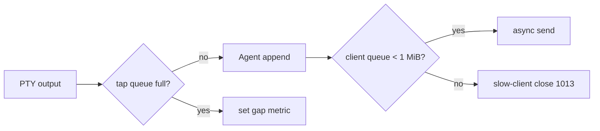

# 04. PC 宿主与接线适配详细设计

## 1. 代码边界与目录建议

本模块不要求本次变更立即落地；以下是实施时推荐的文件边界。现有 `microsoft/src/cascadia/TerminalConnection` 不应引入 WebSocket 依赖。

```text
microsoft/src/cascadia/
├─ TerminalConnection/
│  ├─ IMirrorableTerminalConnection.h     # 最小能力/订阅端口
│  ├─ ConptyConnection.h/.cpp             # 仅 tap 与 input adapter 接线
│  └─ ConptyConnection.idl                # 不对外暴露网络细节
├─ TerminalMirror/
│  ├─ MirrorSessionRegistry.h/.cpp
│  ├─ MirrorSession.h/.cpp
│  ├─ ReplayStore.h/.cpp
│  ├─ InputArbiter.h/.cpp
│  ├─ MirrorTokenStore.h/.cpp
│  ├─ MirrorWebSocketGateway.h/.cpp
│  └─ MirrorDiagnostics.h/.cpp
├─ TerminalApp/
│  ├─ TerminalPage.*                      # 命令、地址 UI、Tab 生命周期
│  └─ MirrorFlyout.*                      # 纯 UI
└─ UnitTests_Mirror/
   ├─ ReplayStoreTests.cpp
   ├─ InputArbiterTests.cpp
   └─ ProtocolTests.cpp
```

PC 端不实现用户管理或公网 Server；它只提供与独立 Tauri Server 的 outbound Agent Adapter。Adapter 把 Core effect 交给安全 tunnel、把 tunnel intent 投递 Core；它只依赖 Connection 抽象，不反向依赖 `TerminalApp`。Tauri Server 的完整职责见 [09-独立 Server 设计](09-tauri-server.md)。

## 2. Connection 适配

当前 `ConptyConnection::_OutputThread()` 在 `ReadFile` 后使用 `til::u8u16`，再 `TerminalOutput.raise(...)`；当前 `WriteInput()` 已使用 `_writeLock` 保证跨线程顺序。本设计增加内部 C++ 接口：

```cpp
class IMirrorableTerminalConnection {
public:
    virtual MirrorCapabilities MirrorCapabilities() const noexcept = 0;
    virtual winrt::event_token MirrorOutput(const MirrorOutputHandler&) = 0;
    virtual void MirrorOutput(winrt::event_token) noexcept = 0;
    virtual void WriteRemoteInput(std::u16string_view text) = 0;
    virtual MirrorTerminalState ExportMirrorState() = 0; // atomic TUI snapshot
};
```

实现注意：

- `MirrorOutput` 传递 `(std::span<const std::byte>, monotonic timestamp)`，不传 UTF-16 文本，不允许订阅者借用 `_OutputThread` 的 stack buffer。
- 在 `ReadFile` 成功且确认 `read > 0` 后、UTF-8 转换前复制输出。订阅者由 `MirrorOutputMux` 维护，调用使用 `try_enqueue`；不直接回调 Agent。
- `WriteRemoteInput` 只是将 `u16string_view` 包装并调用已有 `WriteInput`，保持现有连接状态检查和 ticket lock；不可新建并发的 pipe write 路径。
- `ExportMirrorState` 由持有 TerminalCore 缓冲和模式的层实现；不要让 `ConptyConnection` 反向了解渲染状态。它必须在 TerminalCore 一致性边界内获取活动主/备用 buffer、cursor 与 input modes。Connection 在上层注入 exporter 前报告 `checkpointUnsupported`。

## 3. MirrorSession 状态与 API

```cpp
class MirrorSession {
public:
    task<JoinResult> Join(JoinRequest request);
    task<void> OnOutput(OutputChunk chunk);
    task<InputResult> SubmitInput(ClientId, LeaseId, std::u16string_view);
    task<ControlResult> RequestControl(ClientId);
    task<void> Stop(StopReason);
private:
    SerialExecutor _executor;
    ReplayStore _replay;
    InputArbiter _input;
    ClientMap _clients;
    uint64_t _headSeq{};
    SessionState _state{ SessionState::Starting };
};
```

所有 public 入口先投递 `_executor`。这让输出、客户端加入、租约失效和停止按照单一顺序发生。`Join` 的网络写不在 executor 中 await：executor 只构造不可变发送批次并交给 gateway；gateway 完成/失败再投递 `ClientSendFailed(clientId)`。

## 4. ReplayStore

```text
ReplayStore
├─ Checkpoint { baseSeq, generation, replayBytes, cols, rows }
├─ Ring<OutputFrame> { seq, bytes, timestamp, flags }
└─ GapState { none | needsCheckpoint }
```

### 不变量

1. `headSeq` 严格递增，任一 `OutputFrame.seq` 唯一。
2. 若存在 checkpoint，其 `baseSeq <= headSeq`；恢复范围只包含 `(baseSeq, headSeq]`。
3. 环驱逐任何帧后，若最早可恢复序号不连续，`CanResume(lastSeq)` 返回 false。
4. 任何入队失败将 `GapState` 置为 `needsCheckpoint`，旧 delta 不再用于跨 gap 恢复。
5. checkpoint 和环缓冲分别限额，超额优先压缩/替换 checkpoint，绝不扩大无界内存。

### checkpoint 生成

Host 触发：会话开始、Host 尺寸变更稳定 100 ms 后、`GapState` 置位后、以及可选每 5 秒（限流）。导出应在 TerminalCore 的正确线程/锁边界中执行，得到活动主/备用 buffer、光标、rendition 与 input modes 的原子 `MirrorTerminalState`。导出开始和完成间产生的 output 不能丢失：Core 返回它对应的 `baseSeq`，Agent 只发送严格大于该序号的 delta。导出慢/失败时保留旧 checkpoint，并对新加入者告知 `baselinePending`；绝不阻塞输出。

## 5. 背压



阈值初值：tap 队列 512 KiB，单客户端待发送 1 MiB，会话 replay 4 MiB。实际值需由压测调优并从设置 DTO 读取。**反压方向只能向镜像消费者传播**：慢客户端断开，tap 丢镜像并需要 checkpoint；绝不能暂停 ConPTY pipe read，否则子进程可能因 stdout 管道满而卡死。

## 6. Gateway

PC Agent Adapter 建立一个进程级 outbound 安全 tunnel 到 Tauri Server；不监听 LAN/公网端口。Core Registry 将 `(nodeSessionId, deviceId, policyVersion)` 的路由投影交给 Adapter。每条 route 有独立读限制、写队列和取消 token。

```text
connect → device authentication → policy projection → tunnel ready
       → [read: Server intent → Core command]
       → [write: Core immutable effect → Server relay]
       → disconnect → Core device-offline event
```

不要使用 detached thread，也不要在 `ConptyConnection` 析构中直接停止 tunnel。Adapter 的生命周期由进程级服务拥有，Session 通过 Core 的注册/注销与其解耦；Node 关闭时 Core 发出 route cancellation effect。

## 7. TerminalApp 接线

`TerminalPage` 已负责内容/控件的创建与生命周期。实施时在“已创建并拥有 TermControl + connection”的位置注册可镜像内容：

1. 用户启动 mirror command，TerminalApp 取得当前 content GUID、connection、viewport exporter，向 Registry `StartSession`；
2. Registry 成功后 UI 展示 URL/二维码、只读/控制 token 创建按钮、连接人数与停止操作；
3. tab close、connection state 进入 Closing/Closed 或应用退出时，调用 `StopSession(contentGuid)`；
4. Host 的尺寸变化仅调用 `MirrorSession::PublishHostResize(cols, rows)`，不会重入连接 resize；
5. Host 批准/拒绝/抢占操作通过 `InputArbiter`，不经 WebSocket。

所有 UI 回调以 weak reference 持有页面；会话事件投递 UI dispatcher 后仍需确认 content 未关闭。

## 8. 观测性与错误归属

建议事件：`MirrorSessionStarted`、`MirrorJoinAccepted`、`MirrorJoinRejected`、`MirrorControlChanged`、`MirrorResync`、`MirrorSlowClient`、`MirrorTapOverflow`、`MirrorSessionStopped`。字段只含匿名 session hash、客户端种类、字节数、延迟、错误码；严禁写入 URL、token、终端输出、输入、标题和命令行。

用户可见错误归属如下：连接失败显示“镜像服务不可用”；token 失败显示“链接已失效”；checkpoint 失败显示“无法同步当前画面，可重新开启镜像”；慢客户端显示“连接过慢，正在重新同步”。诊断日志保留 HRESULT/系统错误码用于开发者排查。
