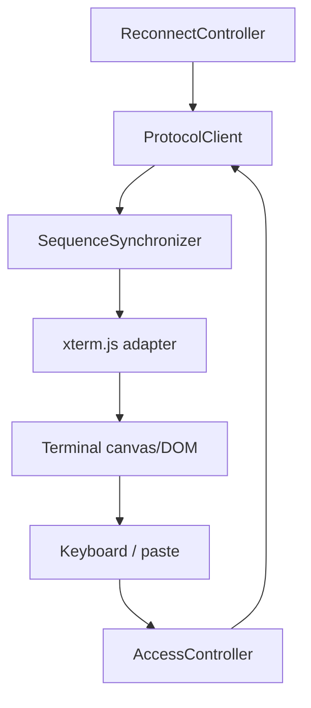
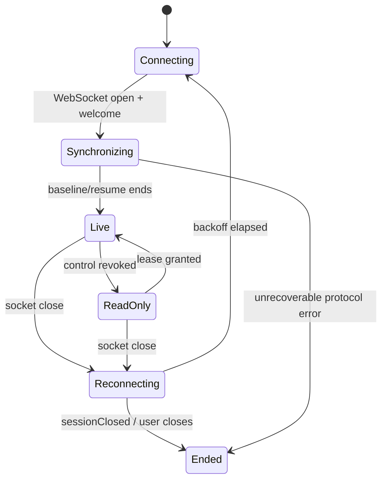

# 05. 客户端详细设计

## 1. 客户端分层

第一期的 Web 客户端使用 xterm.js，负责 VT 解析、Unicode、键盘输入和显示；服务端不应把终端输出解析为 HTML 或行文本。目标是能 attach 正在运行的全屏 AI Agent TUI，而不是只在启动后跟随普通 shell 输出。桌面镜像窗也应使用同一协议与共享 client core，避免形成第二套同步语义。



## 2. Web 页面与安全边界

Web 静态页应从 Host 内置资源或受控本机 origin 提供，禁止采用示例中的公共 CDN：CDN script 供应链与 CSP 不可控，且网页拿到的镜像链接可能包含高敏感终端内容。构建产物固定版本、content hash，并设置：

```text
Content-Security-Policy:
  default-src 'self'; connect-src ws: wss:; script-src 'self';
  style-src 'self'; img-src 'self' data:; base-uri 'none'; frame-ancestors 'none'
Referrer-Policy: no-referrer
Cache-Control: no-store
```

令牌不能放 query string。若用户以一次性分享 URL 打开，页面从 fragment 读出 token，立刻用 `history.replaceState` 移除 fragment，再通过子协议握手送出。页面不得把它打印到 console 或发送 analytics。

## 3. 生命周期



重连采用 decorrelated exponential backoff，初始 250 ms、最大 30 s、带 20% 抖动。网络暂时中断时不清空 xterm.js 屏幕，以避免闪烁；连接恢复后根据 `resumeSeq` 补齐。服务端返回新的 baseline 时，客户端先执行 `term.reset()`，再通过受支持的 state-loader 恢复主/备用 buffer、cursor 与 modes，最后写入 `baseSeq` 之后的 delta，防止旧屏幕状态污染。

## 4. SequenceSynchronizer

```ts
interface Synchronizer {
  expectedSeq: bigint;
  beginBaseline(baseSeq: bigint): void;
  writeBaseline(bytes: Uint8Array): void;
  acceptOutput(seq: bigint, bytes: Uint8Array): "accepted" | "duplicate" | "gap";
  completeCatchup(headSeq: bigint): void;
}
```

- baseline 写入必须早于任何 `seq > baseSeq` 的输出；在 baseline 分块未完成时先缓存输出，缓存上限 1 MiB，超过则要求 `resync`。
- `seq === expectedSeq` 时执行 `term.write(bytes)` 并递增；`seq < expectedSeq` 为重复，忽略；`seq > expectedSeq` 为缺口，停止消费并发送 `resync`。
- `term.write` 是异步渲染队列，不能假定 DOM 已更新后才接收下一帧。client core 保证调用顺序，渲染速度慢时利用 xterm.js 现有流控/批量能力，并在本地队列阈值触发重连而不是占满内存。

## 5. 输入体验

```text
只读：终端可选中文本；按键不发送；顶部显示“仅查看 / 申请控制”
申请中：保留本地焦点；不缓存用户击键；显示“等待主端批准”
控制中：顶部显示剩余 lease；term.onData → input(leaseId, text)
失去控制：立即注销发送 handler，显示撤销原因并保留屏幕
```

不缓存申请期间的键入：在 shell/TUI 中延迟重放键入会带来难以理解的危险操作。粘贴超过 64 KiB 前在客户端先阻止并显示提示；普通 Ctrl+C 由 xterm.js `onData` 产生控制字符，与本地键盘路径一致。浏览器的 `beforeinput`/paste 不能绕开 lease 检查，服务端仍是权威。当 TUI 启用了鼠标/焦点/括号粘贴模式时，客户端必须按当前终端模式编码相应输入：鼠标坐标以**Host 行列**换算，采用快照公布的 encoding（X10/VT200/SGR）；focus in/out 与 bracketed-paste 边界仅在对应 mode 启用时发送。只读端绝不能发送这些事件；浏览器缩放导致行列无法准确映射时禁用鼠标控制并提示。

客户端**不发送 resize**。当浏览器容器变宽时，使用 xterm.js CSS 或 `FitAddon` 的展示计算；如果显示列数不同，提示“镜像尺寸由主终端控制”。这避免 vi、htop 等程序收到来自附属端的 SIGWINCH。

## 6. Web UI 线框

```text
┌──────────────────────────────────────────────────────────────────┐
│ ● 已连接  session …7b47        [仅查看] [申请控制] [断开]       │
├──────────────────────────────────────────────────────────────────┤
│                                                                  │
│   $ build                                                         │
│   ──────────────────────────────────────                         │
│   ... xterm.js terminal viewport ...                              │
│                                                                  │
├──────────────────────────────────────────────────────────────────┤
│ 主终端尺寸 120 × 32   延迟 18 ms   已同步 seq 2048                │
└──────────────────────────────────────────────────────────────────┘
```

- `aria-live="polite"` 只通知连接/控制状态，不朗读每个输出字符。
- 屏幕阅读器用户可切换“终端文本模式”，该模式仅暴露有限、节流后的可视文本；不能以无界 aria live 暴露 shell 输出。
- 深色主题默认跟随终端，CSS 不篡改 xterm 的实际颜色序列。

## 7. 桌面客户端

桌面镜像窗优先复用同一 `ProtocolClient` 和本机 WebSocket endpoint，得到与 Web 相同的授权、恢复和错误语义。它可以用现有 `TermControl` 承载而非 xterm.js，但要额外实现“把 baseline + UTF-8 bytes 喂给 renderer”的适配。为降低 MVP 风险，先发布内嵌 WebView2/xterm.js 版本；等协议稳定、性能数据确认后再替换为原生渲染器。

不能让桌面镜像窗直接订阅 `TerminalOutput` 绕过 Agent，否则其显示会与 Web 的 checkpoint/seq 语义不同，也无法受到同一控制权限约束。

## 8. 客户端测试重点

| 场景 | 预期 |
| --- | --- |
| ANSI 颜色、宽字符、emoji、分段 UTF-8 | 与基准 xterm 截图一致，不出现 U+FFFD 回归。 |
| 全屏 TUI 后加入 | 先 reset，再恢复备用屏、cursor、属性与 input modes，画面与 Host 一致。 |
| 鼠标/焦点/括号粘贴 | mode 启用时编码正确；只读与 mode 关闭时绝不发送。 |
| 乱序/重复输出帧 | 重复不写；缺口请求 resync。 |
| lease 到期时按键 | 本地立即禁用发送，服务端仍拒绝。 |
| 断网 3 秒 | 重连并从 resumeSeq 恢复；无重复字符。 |
| 慢渲染/后台标签页 | 被断开后可重连，主端无卡顿。 |
