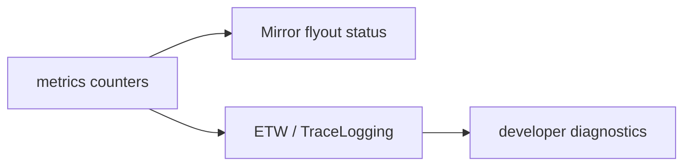

# 06. 安全与运维

## 1. 威胁模型

镜像会话暴露的是可执行 shell 的可视输出与潜在输入通道，敏感度高于普通日志。攻击者可能是同机恶意进程、同网段设备、拿到分享链接的人、恶意网页、或低速耗尽资源的连接。

| 威胁 | 主要缓解 |
| --- | --- |
| 随机扫描本机端口 | 随机端口 + 难猜 session id + 一次性短期 token。 |
| token 从 URL/日志泄露 | token 不进 query、fragment 立刻清理、哈希存储、日志脱敏。 |
| Web 页面跨站连接 localhost | Origin allowlist、握手 token、CSP、禁止 permissive CORS。 |
| 远端输入执行命令 | 默认 view-only、host approval、单 lease、撤销与 TTL。 |
| 慢客户端耗尽内存 | 分层有界队列、关闭 1013、连接/会话上限。 |
| 输出包含秘密 | no-store、无正文 telemetry、停止后清零 token/缓存。 |
| TLS 被降级/中间人 | 远程模式仅 wss，明确证书状态；loopback 可 ws。 |

## 2. 默认安全姿态

```text
默认：enabled=false; listen=loopback; port=ephemeral; TLS=off; remote=false
用户启用 session：view token 一次性生成，15 分钟失效
用户需要输入：必须由 Host 同意；30 秒 lease；Host 可随时 revoke
```

没有“隐式信任 localhost”的例外：任何连接仍须 token，因为本机其他进程和浏览器页面都可能发起连接。进程级 endpoint 在没有活跃会话时关闭；若实现上保持监听，也必须拒绝未知 session 且不泄露 session 是否存在。

## 3. 远程模式（后续，不属于 MVP）

LAN/远程支持需要单独产品开关和安全评审，最低门槛：

1. 明确的 bind address，禁止 `0.0.0.0` 隐式默认；首次启用展示风险确认。
2. TLS 1.2+，可信证书或用户明确接受的自签名指纹；绝不在远程模式回退 `ws://`。
3. 操作系统防火墙规则最小化、可撤销，失败不影响本机镜像。
4. 令牌外加可选设备配对/账户身份；不能把 URL token 当作长期访问控制。
5. 远程审计记录 source address（按隐私策略最小化）、授权和控制事件。

不建议把 NAT traversal、公网中继或云端转发塞进 Terminal 进程；若需要应设计独立 relay 服务、端到端加密和账户权限模型。

## 4. 密钥与隐私处理

- 用 CNG `BCryptGenRandom` 或项目批准的加密 RNG 生成 256-bit token 与 leaseId；禁止 GUID、时间戳或 `rand()`。
- 内存仅保存 token 哈希（带 session secret/HMAC key）和过期时间；明文只在生成与握手比较路径短暂存在，完成后置零尽力擦除。
- 关闭会话时撤销 token、取消连接、释放 replay bytes。Windows 不能绝对保证内存擦除，但应使用安全清零原语处理秘密缓冲。
- 禁止为 bug report 自动收集镜像数据；若用户主动导出诊断，输出独立脱敏预览并要求确认。

## 5. 配置验证与权限

`mirror` 设置解析失败时回退到 disabled 并产生设置警告，不能悄悄启用公网端口。验证规则：

| 字段 | 验证 |
| --- | --- |
| `listen` | 仅 `loopback` / `lan`；`lan` 需 experimental/显式确认。 |
| `port` | 0 或 1024–65535；绑定失败显示具体但不泄密的诊断。 |
| `maxClientsPerSession` | 1–32。 |
| `historyMiB` | 1–32，超过按上限裁剪并警告。 |
| `leaseSeconds` | 5–300。 |
| `controlPolicy` | 固定枚举；未知值回退 `hostApproval`。 |

镜像菜单应该显示当前监听范围和 token 权限。例如“仅此设备、只查看、剩余 14:32”，而不是只显示一个端口号。

## 6. 运维、健康与诊断

不引入常驻后台服务。Mirror Agent 跟随 Terminal 进程；健康由 UI 和 ETW/TraceLogging 事件观察：



建议指标：活跃会话数、每会话客户端数、发送字节、tap overflow、resync 次数、slow-client 断开、授权拒绝、lease 转移、输出延迟分位数。指标维度不允许包含明文 session ID、IP、标题、命令行或 token。

故障分级：

| 级别 | 例子 | 行为 |
| --- | --- | --- |
| 单客户端 | 解码错误、写队列满 | 关闭该客户端，其他人和 Host 继续。 |
| 单会话 | checkpoint 导出持续失败 | 停止镜像、提示重试；终端继续。 |
| 网关 | bind/listener 错误 | 禁用新镜像并提示；活跃会话按策略断开。 |
| Host/PTY | PTY 结束 | 正常发送 closed，清理镜像。 |

## 7. 安全测试清单

- 用模糊测试覆盖 JSON、binary header、分块长度、UTF-16 输入与 WebSocket fragmentation。
- 验证 URL、ETW、崩溃日志、UI 自动化截图中不存在 token；建立 token redaction 单元测试。
- 验证任意 Origin/无 token/过期 token/重放 token 均不可建立会话。
- 验证 32 个慢消费者、持续高吞吐输出时 Host 输入延迟和 ConPTY drain 不退化。
- 使用恶意 ANSI 序列和 xterm.js 安全回归用例，确认不注入 HTML/JS。
