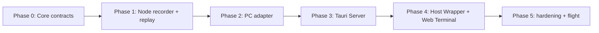

# 07. 实施、测试与验收

## 1. 实施原则

按“Workspace Core 会话记录 → PC 接线 → 独立 Server 控制平面 → Host Wrapper/Web Terminal → 安全加固”的顺序推进。每阶段可独立关闭，任何问题均不应影响标准 Terminal 标签。所有变更默认 feature flag 关闭。



## 2. 里程碑与交付物

### Phase 0 — 契约与原型验证

**交付**：`IMirrorableTerminalConnection`、协议 schema、`ReplayStore` 和 `InputArbiter` 的纯单元测试；不修改 UI/网络。

**门禁**：给定输出流可稳定编号、环缓冲正确驱逐、重复/过期 lease 永不调用 fake input sink；编译不新增 `TerminalConnection → WebSocket` 依赖。

### Phase 1 — ConPTY 旁路与可重放基线

**交付**：ConPTY 原始 UTF-8 tap、bounded queue、TerminalCore/TermControl viewport exporter、Session 内存模型与诊断计数。

**门禁**：

1. 测试 shell 持续输出时，tap 队列故意阻塞/溢出，原始 Terminal 输出和子进程吞吐不下降到死锁；
2. ANSI 颜色、DEC 私有模式、宽字符、组合字符以及主/备用 buffer、cursor、scroll region、bracketed-paste、focus/mouse modes 可导出并在 xterm.js golden harness 中还原；
3. 关闭/失败路径不访问已销毁 connection 或 UI；AddressSanitizer/现有静态分析无新增严重问题。

### Phase 2 — PC Agent Adapter（只读）

**交付**：Core Registry、PC outbound secure tunnel Adapter、Node/window checkpoint-resume effect、慢 route 策略；此阶段不实现用户管理界面。

**门禁**：模拟 Server route 可得到当前 Node 画面；10 秒 tunnel 中断可 resume；无效 capability 被 Core 拒绝；8 个客户端一快七慢时快客户端与 Host 正常；凭据不进入日志。

### Phase 3 — 独立 Tauri Server

**交付**：用户/RBAC、PC 配对注册、设备和 Node 目录、授权、审计、mTLS tunnel relay 与在线 Web Terminal route；完整设计见 `09-tauri-server.md`。

**门禁**：未授权用户看不到 Node；撤销设备/授权即时阻断新 route；Server 不存 terminal 正文；只有 Core lease holder 输入可到 fake sink/真实 ConPTY。

### Phase 4 — 可靠性、安全与 flight

**交付**：CSP、Origin 策略、fuzz、性能基线、feature flag、设置验证、诊断面板与用户文档。

**门禁**：安全评审通过；长时压测（8 小时）无内存线性增长；默认关闭且从不监听非 loopback；回归全量相关 Terminal 测试。

### Phase 5 — 远程实验（独立批准）

仅在 Phase 4 telemetry/反馈满足目标后开始。加入 TLS、LAN bind、证书 UX、防火墙、额外身份验证和单独的威胁建模；不与 MVP 同一发布门禁绑定。

## 3. 测试金字塔

```text
             ┌────────────────────┐
             │ 手工/端到端场景    │  真实 PowerShell、WSL、TUI、浏览器
             ├────────────────────┤
             │ 进程内集成测试     │  Agent + fake gateway + fake connection
             ├────────────────────┤
             │ 协议/属性/模糊测试 │  decoder、seq、token、租约、边界
             ├────────────────────┤
             │ 纯单元测试         │  ReplayStore、队列、配置、策略
             └────────────────────┘
```

### 3.1 必备测试矩阵

| 类别 | 场景 | 断言 |
| --- | --- | --- |
| 输出 | 128 KiB 读块、无效 UTF-8、拆分多字节字符 | 本地 UI 行为不变；镜像 bytes 原样顺序交付。 |
| 重放 | checkpoint 后 0/N 帧、缓存驱逐、tap gap | 正确 resume 或完整 terminal-state baseline，不产生拼接屏幕。 |
| 并发 | 输出、加入、退出、关闭同时发生 | 无 use-after-free、无重复 seq、关闭可终止。 |
| 输入 | 两客户端竞争、lease 过期、Host revoke | 至多一个远端 sink 写入；拒绝可观测。 |
| 性能 | 10 MiB/s 输出、后台浏览器节流 | Host 不等待 socket；内存受限。 |
| 安全 | 伪造 Origin、格式错误 token、超大帧 | upgrade/帧被拒，秘密不外泄。 |
| 兼容 | PowerShell、cmd、WSL、ssh、vim/htop、Codex/Claude Code 类全屏 AI Agent | 备用屏、cursor、鼠标/焦点/粘贴模式与 Host 一致；仅在支持连接上提供菜单。 |

## 4. 性能验证方法

建立可重复测试：ConPTY 内运行产生可控 ANSI 输出的 helper；同时记录 PTY read、Agent enqueue、gateway write、client render 的时间戳。报告 p50/p95/p99 延迟、CPU、RSS、丢弃/resync 数。基线须分别在“无 mirror”“一个快客户端”“八个快客户端”“一个快+七个慢客户端”采集。

发布阈值：与无 mirror 基线相比，持续输出时 Host 线程 CPU 增加不超过 5%，正常本机 p95 额外延迟不超过 100 ms；慢客户端场景内存平台化且 Host 仍可输入。若未达到，默认只读或 feature flag 不进入稳定通道。

## 5. 回滚与兼容

- feature flag `experimental.mirror` 默认 false；禁用后不创建监听器、不注册 tap。
- 设置中未知 `mirror` 字段按现有 settings 容错保留/忽略策略处理；旧 settings 不需要迁移。
- 协议按 `/v1` 路径和子协议名版本化；服务端保留 v1 行为直到所有内置客户端升级窗口结束。
- 发现安全漏洞时，可远程配置/更新将 flag 置 false；已存在会话主动关闭并撤销 token，Terminal 继续运行。

## 6. 最终验收清单

1. 在任意支持的 ConPTY 标签启用镜像，本机浏览器可凭一次性链接看到完整当前状态和实时输出；对正在运行的全屏 AI Agent TUI，备用屏、光标、样式和输入模式与 Host 一致。
2. 两个只读端同时观看，输出有序且不影响本地 Terminal；断开后重连符合 resume/baseline 规则。
3. 远端控制必须经 Host 批准，抢回、过期、断开均可靠撤销；输入不交错。
4. 关闭标签/停止镜像会撤销 endpoint、令牌和缓存；不会产生悬挂线程或阻塞退出。
5. 默认设置不会监听 LAN/公网，安全/隐私测试和性能门禁全部通过。
6. 当前 `TerminalOutput`、`WriteInput`、本地 resize、连接状态转换及既有终端测试无行为回归。

## 7. 开发前决策记录

在进入 Phase 1 前，技术负责人需要明确记录以下决策：

- viewport exporter 的所有者（TerminalCore 或 TermControl）与能保证的 VT 语义；
- 网关实现选型及许可/依赖审查；
- 内置 Web 资源的构建、版本更新与 CSP 方案；
- Host 批准 UX、二维码/链接展示和 Windows 隐私提示；
- feature flag、遥测合规和远程模式是否另立项目。

这些决策未完成前，不应按参考文档直接把 WebSocket server 和 detached thread 放入 `ConptyConnection`；那会固化错误的生命周期与安全边界。
