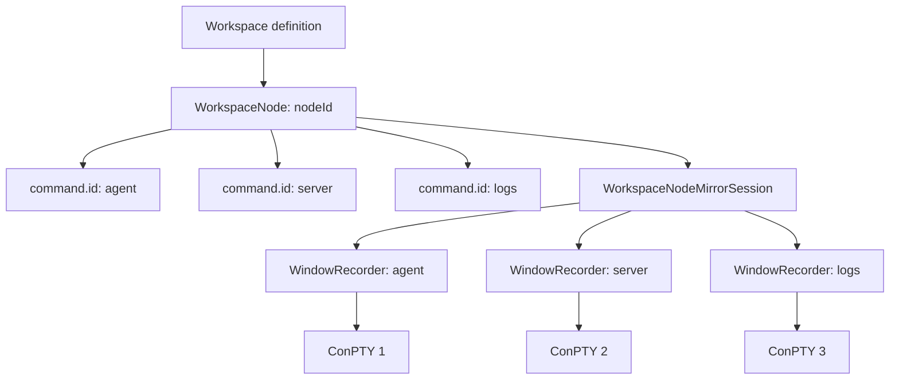
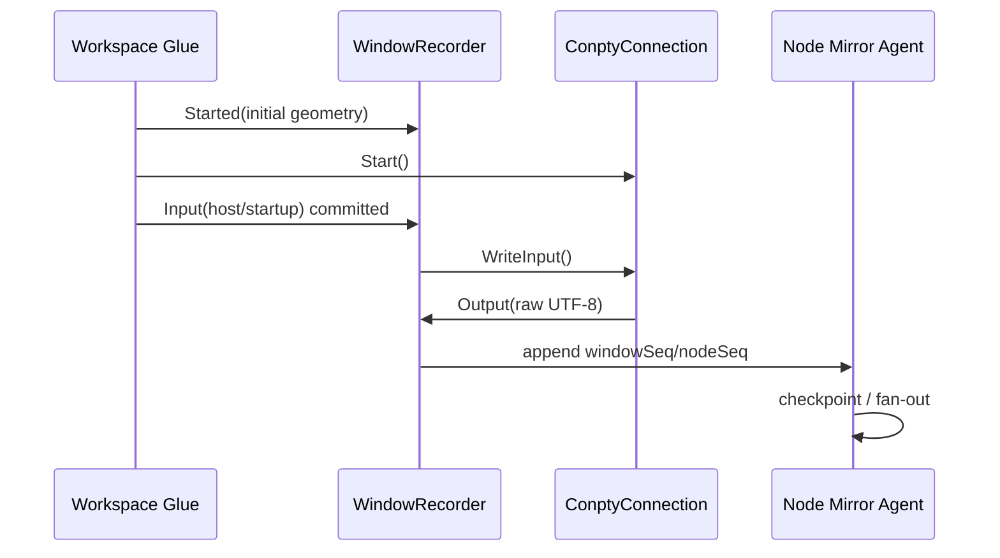
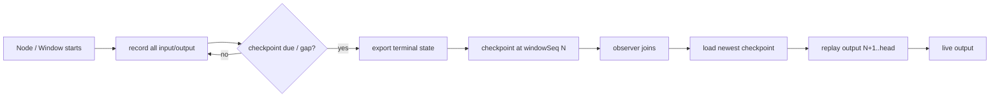

# 08. Workspace Node 会话记录与多端还原

## 1. 定位：镜像是 Node Runtime 的固有能力

Mirror 不应是用户对某个已运行标签临时点击“开始/停止同步”的附加功能。这样会天然丢失 TUI 在开始同步之前已经设置的备用屏、模式和画面，无法达成多端 attach 的体验。

本设计**集成**现有 Workspace 的层次：`Workspace → Node → commands (1..3) → Window Runtime`。它不替换或继承 Terminal/Workspace 的运行时对象：Workspace Core 继续拥有 Node 配置、布局和稳定 `command.id`；Workspace Glue 在既有 Node 启动链中创建 `WorkspaceNodeMirrorSession`；TerminalConnection 继续拥有 ConPTY I/O；TerminalMirror 以适配器订阅记录和提供 attach。Glue 准备启动一个 Node 时，先创建 Node Session；它再按 `command.id` 为每个即将创建的 ConPTY 窗口建立 `WindowRecorder`。Recorder 的生命周期覆盖进程创建前、运行中和关闭后的有限 draining，而不是连接某个客户端后才开始。



`command.id` 是唯一稳定关联键；不能使用数组下标、Tab index 或 ConPTY handle。命令重排只改变 Node 的展示顺序，不重写运行中的 recorder 归属。Node 关闭、某 command 子进程退出或 Workspace 被替换时，分别产生明确的 session/window lifecycle event。

## 2. 客户端模型：Terminal Host Wrapper 优先

附属端的首要产品形态是**另一个设备上的 Terminal Host Wrapper**。Host Wrapper 用 WebView 承载内置的 Web terminal application（xterm.js + shared `ProtocolClient`），因此它和浏览器不是两份显示/同步技术栈，而是同一个：

```text
             same static assets + same protocol + same state loader
                                     │
Node Mirror Gateway ────────────────┼───────────────┐
                                    ▼               ▼
                     Terminal Host Wrapper       Browser
                       WebView + xterm.js       xterm.js
                       node layout shell        diagnostic/light client
```

Host Wrapper 在本地提供窗口、Workspace Node 选择、身份/设备配对、全屏、键盘焦点、剪贴板权限和系统通知；WebView 负责终端栅格渲染、VT 状态装载、协议、重连和输入编码。浏览器入口复用这套 Web 应用，但不是功能和兼容性的唯一基准。

远端 Host Wrapper 打开的是**整个 Node Session**，先获得 Node 描述（名称、图标、命令顺序、Split/Tab 偏好、每窗口运行状态），再为每个窗口独立同步。因此一个 Node 的 2/3 个 TUI 可以像主端一样按 Split/Tab 还原，而不是在一个 byte stream 中混合。

## 3. 启动时 I/O 记录

### 3.1 事件日志

每个 `WindowRecorder` 保存 append-only、顺序编号的事件流。记录从 `CreateWindowRecorder(commandId)` 返回成功起开始，必须早于 `ConptyConnection::Start()` 和任何 startup input replay。

```cpp
struct WindowEvent {
    uint64_t windowSeq;
    uint64_t nodeSeq; // Node 内跨窗口观察/审计顺序
    std::chrono::steady_clock::time_point timestamp;
    WindowEventKind kind; // Started, Input, Output, Resize, Title, Checkpoint, Exited
    EventOrigin origin;   // host, remote-client-id hash, system
    std::variant<InputUtf16, OutputUtf8, Resize, Title, MirrorTerminalState, ExitInfo> payload;
};
```

| 类型 | 写入位置 | 用途 |
| --- | --- | --- |
| `Started` | 创建 connection 前 | 建立初始 rows/cols、profile/command metadata 的不可变基线。 |
| `Input` | 任一来源调用 `WriteInput` 前，成功入写队列后 | 审计、时间线、TUI 行为复盘；不是屏幕重放的唯一依据。 |
| `Output` | `_OutputThread()` 成功读取 UTF-8 后、转换前 | 权威显示增量；保持原始字节和分块顺序。 |
| `Resize` | Host 决定并调用 connection resize 时 | 重放时还原栅格几何，禁止附属端产生。 |
| `Title` | OSC/Terminal title 回调 | 恢复 Node tab 标签和可访问名称。 |
| `Checkpoint` | TerminalCore 状态导出完成 | 快速且准确地 attach 全屏 TUI。 |
| `Exited` | connection state terminal transition | 允许客户端保留只读最终现场。 |

输入绝不能仅记录远端输入：本地 Host 的键盘、粘贴、Workspace 的 startup input，以及批准后的远端输入都必须穿过同一个 `RecordThenWrite` 适配器。每次 event 记录的 `origin` 只存匿名 client hash；正文仍在内存 session log 中按敏感数据策略处理，绝不写 telemetry。

### 3.2 写入顺序与不变量



1. 同一 window 的 `windowSeq` 单调递增且无洞；`nodeSeq` 由 Node Session 单一 serial executor 分配。
2. `Input` 先入 recorder 的输入队列，再调用 connection；若 connection 拒绝（已关闭）记录 `InputRejected`，不得把它伪装成已送达。
3. `Output` 同时给既有 `TerminalOutput` 和 recorder，任一 recorder 失败不得回压 PTY。若 recorder tap 溢出，追加 `Gap` 事件并马上请求完整 checkpoint；在成功 checkpoint 前不允许宣称可精确恢复。
4. `Resize` 与 checkpoint 建立因果关系：checkpoint 声明其 rows/cols 和对应的 `windowSeq`，后续 delta 只能在相同或明确 resize 后的栅格中应用。

## 4. TUI 现场恢复算法

只存“最新画面截图”不够，纯粹从后来输出 replay 也不够。Recorder 同时保留**启动以来的日志**与周期性强一致 `MirrorTerminalState` checkpoint：前者保证历史与故障回放，后者以可接受延迟 attach。



恢复规则：

1. 客户端先接收 Node layout/descriptors，再按每个 window 的最新完整 checkpoint 建立独立 terminal instance。
2. state loader 原子装载主/备用 buffer、cursor、cell attributes、scroll region、saved cursor、palette、hyperlinks、DEC modes、mouse/focus/bracketed-paste 状态和 rows/cols。
3. 重放 checkpoint `windowSeq` 之后的 `Output` 事件；`Input` 事件用于 timeline/审计而非再次注入到 emulator，避免重复副作用。
4. 遇到 `Resize` 先按记录改变实例几何，随后继续 output replay；遇到 `Title` 更新 Node 子 Tab 文本。
5. 若没有可用 checkpoint（最早启动阶段），从 `Started` 的受控 reset 状态按全量 output replay；这是唯一允许的从零重建路径。

因此，正在运行 Codex/Claude Code 等使用 alternate screen 的 TUI，在观察者连接前已经绘制的内容不会丢失：它已在启动时被记录，且最新状态检查点含备用屏和输入模式。恢复成功的定义是“新端可继续观看并在获得 lease 后交互”，不是只得到一张静态截图。

## 5. Node 持久化与运行时状态边界

配置随 Workspace 持久化；真实会话日志默认只随正在运行的应用存在，不随 settings 同步或长期落盘。这样避免把 shell 输出/secret 混入 workspace 配置。

```json
{
  "id": "backend-agent",
  "commands": [{ "id": "agent", "command": "codex" }, { "id": "server", "command": "npm run dev" }],
  "multiWindowMode": "split",
  "splitWeights": [0.55, 0.45],
  "mirror": {
    "mode": "node-session",
    "recordOnStart": true,
    "retention": "until-node-close",
    "remoteAttach": "paired-devices"
  }
}
```

`mirror.mode` 只有 `node-session`；不要提供在运行中切换为“是否开始记录”的选项。设置允许控制 retention 内存上限、是否允许配对设备和控制策略，但 `recordOnStart` 在可镜像 Node 上必须为 true。老 Node 配置没有 `mirror` 时按 workspace migration 写入安全默认值；普通非 Workspace tab 不创建 Recorder，也不在 UI 显示 attach 功能。

## 6. 保留、容量与崩溃语义

完整输入/输出记录可能很大。运行期默认采用内存环 + checkpoint，建议每 window 32 MiB 输出、4 MiB 输入/metadata、每 Node 最多 96 MiB；达到上限前优先保留最新完整 checkpoint 和其后的输出。若产品需要“从启动完整回放”，应使用用户加密的 session journal 文件并单独确认，因为其中可能有凭据和代码。

“保证还原现场”在进程仍运行期间定义为：不发生 recorder gap 时，最新 checkpoint + 完整后续输出可还原；若内存驱逐了更早历史不影响当前 attach。若 recorder gap、state exporter 失败或应用崩溃，UI 必须显示恢复可信度和原因，不能静默展示不完整的 TUI。后续可用 journal + crash recovery 扩展到进程重启后，但不纳入本期承诺。

## 7. 与现有 Workspace 的 Core 集成

现有设计中 `WorkspaceCore` 已以 `WorkspaceNodeCommand.id` 管理 1～3 个命令、布局和 `WorkspaceNodeSessionState`；Mirror 的 Node/Window session、event store、checkpoint index、lease 与恢复计划直接实现为 `src/core/workspace/mirror/` 的领域模块。禁止在 `src/core/workspace` 根目录增加 `WorkspaceCoreMirror.*` 这类聚合实现文件；按 `MirrorNodeSession`、`MirrorEventStore`、`MirrorCheckpoint`、`MirrorRecoveryPlanner`、`MirrorControlLease`、`MirrorAuthorization`、`MirrorReducer` 等职责分文件。`TerminalPage` / `TerminalPageBase` 仅提供 workspace runtime 接线入口；Core 不依赖 ConPTY 或 WebView，而是通过 port 输出 effect：

```cpp
class IWorkspaceNodeMirrorRuntime {
public:
    virtual void BeginNodeSession(const WorkspaceNode& node, WorkspaceWindowId window) = 0;
    virtual WindowRecorderHandle BeginWindow(const std::wstring& nodeId,
                                             const std::wstring& commandId,
                                             InitialTerminalGeometry) = 0;
    virtual void AttachConnection(WindowRecorderHandle, IMirrorableTerminalConnection&) = 0;
    virtual void EndWindow(WindowRecorderHandle, WindowExitReason) = 0;
    virtual void EndNodeSession(const std::wstring& nodeId) = 0;
};
```

Glue 在 `RegisterWorkspaceNodeRuntimeStateIfNeeded` 的同一启动链上取得 `nodeId/commandId`，但实际 recorder 创建必须早于 `Start()`；可在创建 `NewTerminalArgs`/connection 的工厂路径注入 handle。Glue 只执行 Core 下发的 `AttachConnection` / `WriteInput` / `PublishSnapshot` effect 并把真实 I/O 回送 Core。Host Wrapper/WebView 只渲染 Core projection、提交 intent；它们不持有 recorder、lease 或恢复决策。

## 8. 本文新增验收

1. Workspace Node 启动两个命令后 10 分钟才有附属 Host Wrapper 加入；两个窗口均按 Node Split/Tab 布局显示，且先前的 Agent TUI 现场完整出现。
2. 在备用屏 TUI 中进行本地键盘、鼠标、bracketed paste 后，附属端 attach 并获得控制，可继续操作，不触发错误的 mouse coordinate 或输入模式。
3. 暂停/断开附属端后继续运行 Node，再恢复连接；每个 commandId 从各自 checkpoint/seq 恢复，不串窗、不重复输出。
4. Node 的一个窗口退出时，其最终状态保持只读，其他窗口继续；Node 整体关闭后所有 device token、I/O 环和 state buffers 被销毁。
5. 从 Workspace 配置启动的 Recorder 在任何客户端加入之前已有 `Started`、startup input 和第一份 output 记录；禁止先启动 ConPTY 再初始化 recorder。
