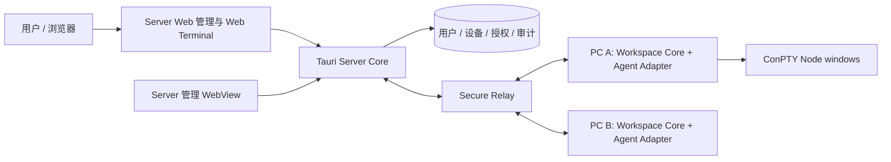
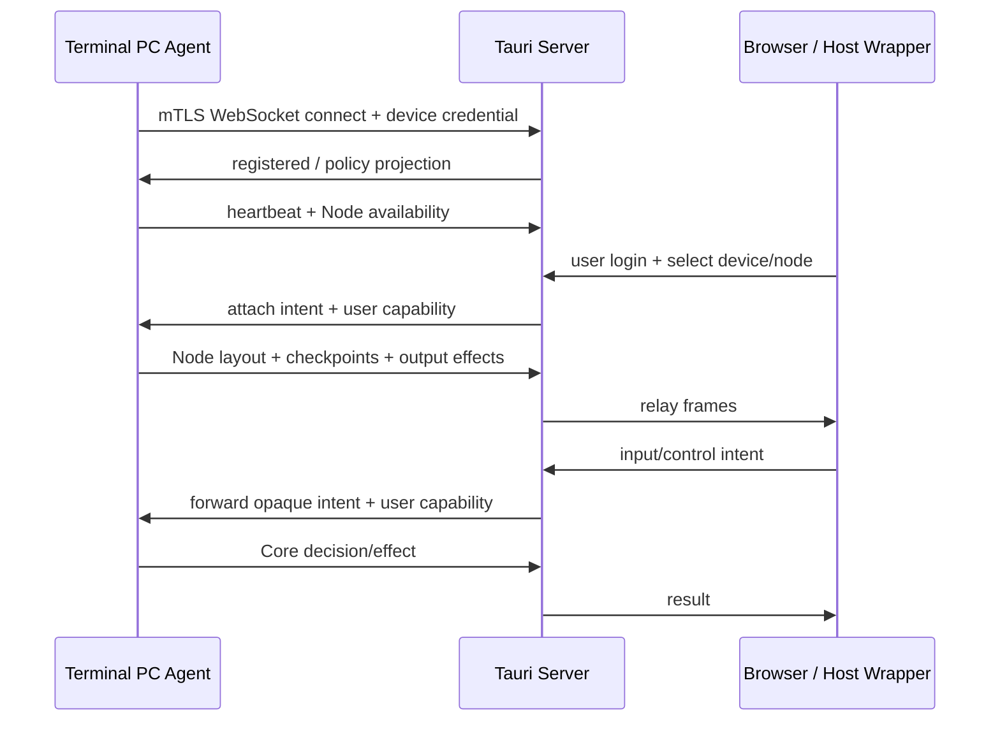
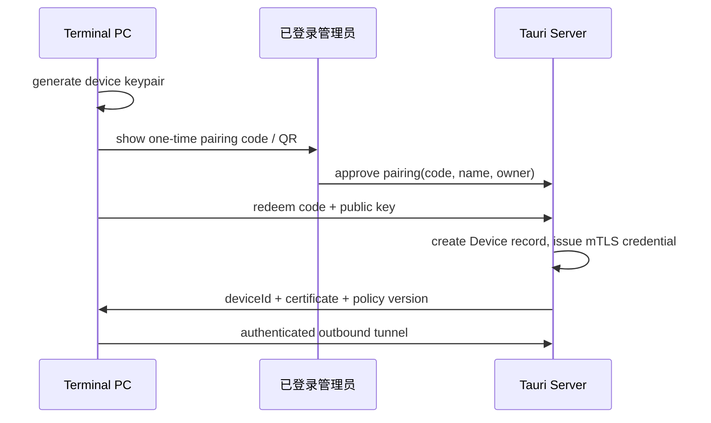

# 09. 独立 Tauri Server 设计

## 1. 定位与边界

Server 是一个**独立项目**，以 Tauri 实现。它不是嵌入 Windows Terminal 进程的轻量 WebSocket listener，也不负责解析 VT、记录 I/O 或裁决 TUI 会话的控制权。它提供四类产品能力：

1. **用户与组织管理**：账号、登录、角色、设备归属与审计；
2. **Terminal PC 注册与在线目录**：每台运行 Terminal Agent 的 PC 注册为受管设备，持续上报在线状态、可访问 Workspace Node 和能力；
3. **管理功能**：用户/设备/Node 授权、配对、在线状态、会话观察、撤销与审计；
4. **在线 Web Terminal**：Server 托管同一套 Web terminal application，用户浏览器通过它选择 Node、attach 多窗口 TUI 并请求控制。

Tauri 的 Rust Core 运行 Server 服务、认证、持久化和安全隧道；Tauri WebView 前端承载管理控制台与在线 Web Terminal。部署形态可为桌面常驻 Server，也可在后续将同一 Rust Core 提取为 headless service；业务协议与存储层不得依赖 WebView。



### 1.1 职责矩阵

| 能力 | PC Workspace Core | Glue / Host | Tauri Server | 在线 Web Terminal |
| --- | --- | --- | --- | --- |
| Node 启动时记录 Input/Output/Checkpoint | 权威实现 | 接入 ConPTY | 不保存正文 | 消费恢复流 |
| TUI 状态恢复计划 | 权威生成 | 执行 effect | 中继 opaque payload | state-loader/render |
| 控制 lease/抢占/输入是否合法 | 权威裁决 | 执行 write effect | 转发 intent/result | 提交 intent/显示状态 |
| 用户登录、组织与设备归属 | 接收授权投影 | 无 | 权威实现 | 登录 UI |
| PC 注册、配对、在线状态 | 上报自身状态 | 提供 PC identity | 权威目录 | 浏览/管理 |
| 用户对 Node 的访问授权 | 最终强制执行 capability | 无 | 管理授权策略、签发 capability | 请求访问 |
| 网络穿透/多设备中继 | 发起 outbound tunnel | 无 | 安全路由与背压 | WebSocket 接入 |

**最终原则**：Server 的用户/设备/资源授权决定“谁可以请求什么”；PC Core 对每一个实时 intent 仍做最终授权和 lease 校验。Server 无法凭借中继位置绕过一台 PC 上的 Core。

## 2. 运行拓扑与连接方向

所有 Terminal PC 主动连接 Server，避免 Server 反向连接私网 PC、固定开放端口或要求用户配置 NAT。



- **PC tunnel**：一台 PC 一个长期 outbound mTLS WebSocket/QUIC stream。网络断开后指数退避重连；Server 永不要求 PC listen 公网端口。
- **用户连接**：浏览器/Host Wrapper 与 Server 以 HTTPS/WSS 连接；Server 验证 session/OIDC token。
- **会话中继**：Server 按 `deviceId/nodeId/windowId/clientId` 路由加密帧，维护连接级背压和上限，但不反序列化或持久化终端正文。
- **Server 不在线时**：PC Core 继续记录运行中 Node；本机 Host 不受影响。远端 attach 不可用，恢复服务后客户端从 Core checkpoint/resume 重新同步。

## 3. 用户、组织和角色

第一期推荐单组织（personal/team workspace）模型，数据结构仍带 `organizationId`，避免未来破坏性迁移。

| 角色 | 权限 |
| --- | --- |
| `owner` | 管理组织、用户、全部设备、授权策略、撤销设备。 |
| `admin` | 管理用户/设备/Node 授权、查看审计，不可转移 owner。 |
| `operator` | 在被授权 Node 上 attach、申请/使用控制权。 |
| `viewer` | 只读 attach 被授权 Node。 |
| `device` | 仅建立 PC tunnel、上报自身和接收已路由 intent；不是人类用户。 |

用户认证可先采用本地账号（Argon2id password hash + TOTP 可选）或接入 OIDC；两者归一为 Server session。不要让 Windows Terminal 保存用户密码，PC 只保存经配对签发的设备证书/refresh credential。

## 4. 设备注册与配对

### 4.1 注册流程



配对码 10 分钟失效、单次使用并绑定 pending public key challenge。私钥使用 OS credential store/DPAPI 保存，不写入 Workspace 配置或日志。管理员撤销设备后 Server 立即断开 tunnel，PC 下次 policy refresh 也应停止远端服务。

### 4.2 Server 数据模型

```text
User(id, organization_id, login, password_hash?, status, created_at)
RoleBinding(user_id, organization_id, role)
Device(id, organization_id, owner_user_id, public_key, display_name, status, last_seen_at)
DeviceSession(device_id, connection_id, connected_at, heartbeat_at, capability_version)
NodeResource(id, device_id, workspace_id, node_id, display_name, layout_version, online_state)
NodeGrant(id, node_resource_id, subject_user_id|role, permissions, expires_at)
PairingRequest(id, organization_id, code_hash, public_key_challenge, expires_at, consumed_at)
AuditEvent(id, organization_id, actor_id?, device_id?, node_id?, type, metadata, occurred_at)
```

`NodeResource` 是 PC Core 上报的**目录投影**，只含展示和授权需要的 metadata（Node 名称、图标、命令显示名、窗口数量、运行状态、能力、版本），不含 commandline、terminal output、输入、checkpoint 或 token。

## 5. Node 目录、授权与控制

PC Core 在 Workspace Node 启动/关闭和布局变化时上报 `NodeAvailabilityProjection`。Server 根据 `NodeGrant` 过滤后给用户返回目录。用户只可见被授予的设备和 Node。

```text
Server: can user U access device D / node N?  →  签发短期 signed capability
PC Core: does capability match current device/node/session/policy + local lease? → allow / deny
```

capability 至少绑定：`userId`、`organizationId`、`deviceId`、`nodeId`、permission、issued/expiry、nonce、policyVersion。默认 60 秒有效；PC 必须验证签名、受众、时钟窗口和 Node session 匹配。Server 修改/撤销 grant 时增大 policy version 并经 tunnel 通知 PC；PC 在收到撤销或 capability 过期后拒绝新 intent、撤销相应远端 lease。

Server 管理端可发出 `revokeControl` / `disconnectClient` 管理 intent，但不能自己伪造 input 或直接把某用户标成 lease holder；由 Core 将其作为策略变更和控制事件处理。

## 6. 在线 Web Terminal

Server 提供受登录保护的 Web route，例如 `/terminal`。它复用 Host Wrapper WebView 内置的同一 Web application package：

```text
shared/web-terminal/
├─ protocol-client/       # hello, resume, control intent, sequencing
├─ node-session-store/    # Node layout and per-window state
├─ xterm-renderer/        # state-loader + VT delta renderer
├─ input-adapter/         # keyboard/mouse/focus/bracketed paste
└─ management-shell/      # device/node picker and role-aware chrome
```

用户流程：登录 → 选择设备 → 选择可访问 Node → Server 建立 client route → PC Core 返回 Node layout 和每个 window 的 checkpoint/增量 → Web app 渲染 Split/Tab → 用户仅在获 Core lease 后输入。浏览器重连只向 Server 提交 `resume` intent；真正的 checkpoint/resume 规划仍由 PC Core 产生。

管理 WebView 与在线 Web Terminal 可以同壳但须分 route 和 CSP。在线 terminal route `Cache-Control: no-store`，不写 terminal output 到 local storage、service-worker cache、analytics 或 error reporter。

## 7. Tauri 项目结构

```text
mirror-server/
├─ src-tauri/
│  ├─ src/
│  │  ├─ auth/              # sessions, OIDC/local auth, RBAC
│  │  ├─ devices/           # pairing, mTLS, heartbeat, registry
│  │  ├─ resources/         # Node directory and grants
│  │  ├─ relay/             # tunnel multiplexing, backpressure
│  │  ├─ audit/             # metadata-only audit sink
│  │  ├─ api/               # management + terminal routing APIs
│  │  └─ storage/           # migrations/repositories
│  └─ tauri.conf.json
├─ ui/
│  ├─ management/           # users/devices/grants/audit pages
│  └─ web-terminal/         # shared WebView/browser application
└─ crates/protocol/          # shared schema; generated TS/Rust bindings
```

Tauri command IPC 仅服务本机管理 WebView。对远端 PC 与浏览器的 API 使用明确的 HTTPS/WSS Server，不能把 Tauri command 当远程协议。`crates/protocol` 与 Terminal 工程的 Core DTO schema 通过版本化 JSON/CBOR contract 对齐；不共享 Rust/C++ 内存对象。

## 8. Server API 与中继协议

管理 API 示例：

| API | 权限 | 行为 |
| --- | --- | --- |
| `POST /api/v1/pairing-requests` | owner/admin | 创建配对挑战。 |
| `POST /api/v1/pairing-requests/{id}/approve` | owner/admin | 签发设备凭据。 |
| `GET /api/v1/devices` | role-filtered | 列出设备和在线状态。 |
| `GET /api/v1/nodes` | grant-filtered | 列出可访问 Node 投影。 |
| `PUT /api/v1/nodes/{id}/grants` | owner/admin | 更新 Node 授权并推送 policy version。 |
| `GET /api/v1/audit` | owner/admin | 查询 metadata 审计。 |

Terminal route 使用 WSS：用户连接到 `wss://server/v1/terminal`，Server 完成用户认证和 Node grant 判定后创建 `routeId`，将客户端帧封装转发至对应 PC tunnel。帧头包含 route/device/node/window/client/trace ids；payload 为版本化 Core intent 或 Core effect。Server 可以检查长度、路由和速率，不能更改 `seq`、checkpoint 或 lease payload。

## 9. 安全、审计与隐私

- PC tunnel 使用 mTLS；用户使用 HTTPS/WSS + 安全 session；配对和 capability 均为短期、可撤销凭据。
- Server 数据库存储账号、设备公钥、授权、在线 metadata、审计事件，不存 terminal output/input/state snapshot。可选录制是未来单独授权的产品能力。
- 审计记录 login、pair/approve/revoke、device online/offline、grant change、attach request、control request/grant/revoke、route disconnect；不记录键入和屏幕正文。
- relay 采用每 route/client/window 有界队列。慢浏览器被断开；慢 Server/网络只能令客户端重新从 PC Core checkpoint 同步，不能反压 ConPTY。

## 10. Server 验收

1. 管理员可在 Server 创建用户、批准新 PC 的配对、看到在线/离线与其 Node 目录，并可撤销设备或 Node grant。
2. 一台 PC 启动包含 2/3 个窗口的 Workspace Node 后，另一个账号仅看到被授予的 Node；在线 Web Terminal 与 Host Wrapper 均用同一 Web application 还原布局和 TUI。
3. 用户授予/撤销 Node 权限后，Server 与 PC Core 均在 policy version 更新后拒绝新 attach；正在持有的控制 lease 被按策略撤销。
4. Server 仅中继时不保存终端正文；检查数据库、审计与日志均无 output/input/token 明文。
5. Server 或网络重启时，PC 的本地 Node 和 recorder 不受影响；远端重新连接后从 PC Core 的 checkpoint/resume 恢复。
