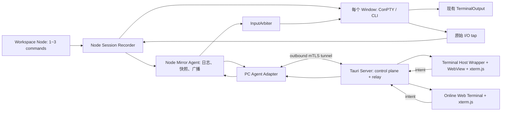

# 多端终端镜像（Mirror）设计文档

## 目标

本设计为 Windows Terminal 派生工程增加一个与 **Workspace Node** 绑定的**多端终端镜像**能力：一个节点内的 1～3 个 ConPTY 窗口自启动起即被持续记录，可被多个受控终端 Host Wrapper 或浏览器同时 attach；被授予控制权的一个客户端可将输入写回同一窗口。体验上接近 tmux 的 attach / detach，但不改变既有 ConPTY 或命令行进程的语义。

这里的“客户端”优先是另一设备上的 **Terminal Host Wrapper**（内嵌 WebView），浏览器是同一 WebView/xterm.js 客户端的在线入口；二者使用同一服务端协议、静态资产、恢复逻辑与控制规则。Terminal PC 通过 outbound 安全 tunnel 注册到独立 Server，跨 NAT 和中继由 Server 管理；多人协作控制不默认开启。

## 文档导航

| 文档 | 回答的问题 | 主要读者 |
| --- | --- | --- |
| [01-需求与范围](01-requirements.md) | 做什么、不做什么、怎样算成功？ | 产品、开发、测试 |
| [02-总体架构](02-architecture.md) | 为什么分层，数据如何流动？ | 架构、开发 |
| [03-协议与状态同步](03-protocol.md) | 客户端怎么连接、重连、同步与控制？ | 客户端、服务端 |
| [04-宿主与服务端详细设计](04-host-and-server.md) | C++ 模块落在哪里，线程和背压如何处理？ | Terminal C++ 开发 |
| [05-客户端详细设计](05-client.md) | Web/桌面客户端如何渲染和发送输入？ | 前端、客户端 |
| [06-安全与运维](06-security-operations.md) | 如何鉴权、授权、审计与诊断？ | 安全、运维 |
| [07-实施、测试与验收](07-delivery-test.md) | 如何分阶段实现并证明可用？ | 项目、QA、开发 |
| [08-Workspace Node 会话记录](08-workspace-node-session.md) | 如何集成 Node 多窗口模型，并从启动时记录以还原 TUI？ | Workspace、Terminal、服务端开发 |
| [09-独立 Server 设计](09-tauri-server.md) | Tauri Server 的用户、设备注册、管理和在线终端职责 | Server、前端、Terminal 开发 |

## 核心决策摘要

- **Node 启动即记录，不提供临时“开启同步”开关。** Workspace Glue 创建 Node 的多个窗口前创建 Recorder；输入、输出和检查点都以稳定 `nodeId + commandId` 归档，旁观者晚加入也可从启动现场恢复。
- **不在 `ConptyConnection` 内嵌 HTTP/WebSocket 服务器。** 连接层只暴露镜像 I/O tap 和受控写入入口；网络、会话登记、令牌和慢客户端隔离到 Node Mirror Agent。
- **镜像的是事件日志和终端状态快照。** 连接中的客户端收增量；新连接/断线重连先装载主/备用 buffer、光标和模式的检查点，再按单调序号补事件。启动以来的原始输出和输入均被持续记录，检查点仅用于加速恢复。
- **TUI 是硬性兼容目标。** 全屏 AI Agent 界面（备用屏、光标、SGR 样式、鼠标/焦点报告、括号粘贴、OSC 标题/超链接）必须以同一终端状态 attach；“只显示普通命令行文本”不是可验收的降级。
- **单会话单控制者（control lease）。** 所有人默认只读；控制需要显式申请、获得短租约并可被本地宿主抢回。这样避免多个键盘交错写入同一 shell。
- **Server 是独立 Tauri 项目。** 它提供用户/设备管理、Terminal PC 注册、在线状态、Node 管理界面、在线 Web Terminal 和安全中继；PC 端 Core 仍是运行期会话与控制的权威。

## 名词与边界

| 名词 | 定义 |
| --- | --- |
| Host | 运行 Windows Terminal 的进程及其本地 UI。 |
| Session | 一个稳定的镜像会话，1:1 对应可镜像的 `ITerminalConnection` / ConPTY 标签内容。 |
| Mirror Agent | 宿主进程内的逻辑服务，管理会话、历史、授权和端点；可将网络网关放入独立组件。 |
| MirrorTap | 从连接输出采集原始 UTF-8 数据的旁路订阅点，不参与原始 UI 输出路径的成功与失败。 |
| Baseline | 客户端开始渲染前必须得到的重放数据与终端尺寸/版本信息。 |
| Lease | 输入控制权的短期、可续约、可撤销排他租约。 |

详细设计以当前仓库为依据：`microsoft/src/cascadia/TerminalConnection/ConptyConnection.cpp` 的 `_OutputThread()` 已读取原始 UTF-8 并转换后触发 `TerminalOutput`，`WriteInput()` 已提供有序写入；本设计在其附近增加小型连接适配层，而非替换这些既有路径。
